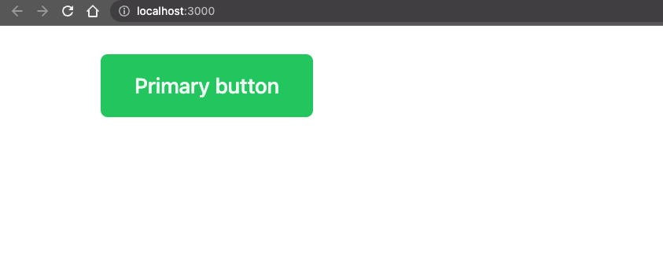
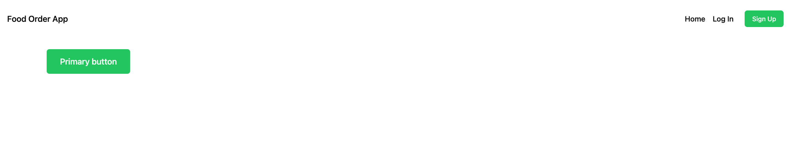

# Create a food ordering app with Strapi and Next.js 1/7


_Updated April 2023_
This tutorial will walk you through how to use [Next.js](https://strapi.io/integrations/nextjs-cms) to power your UI, complete using **GraphQL, Stripe, Strapi, and Next** to developing a full-stack application complete with the powerful Strapi (Headless CMS) powering the backend.
Get ready to develop an **online food ordering app, more info on the tech stack here:** [**Next.js**](https://strapi.io/integrations/nextjs-cms)**,** [**GraphQL**](https://graphql.org/)**,** [**Stripe**](http://stripe.com/) **and** [**Strapi**](https://strapi.io/)! From sign up to order, you are going to let users discover restaurants, dishes and order meals.
Your app will be complete with user login, registration, authentication, image upload, restaurant creation, dish creation, cart functionality, and stripe order integration.
The **demo of the final result** should make you hungry:


_Note: the source code is available on GitHub for_ [_Frontend_](https://github.com/divofred/food-ordering-app) and [Backend](https://github.com/divofred/strapi-app).
Screenshots of final product:


**Strapi:**
[**Strapi**](https://strapi.io) [](https://github.com/strapi/strapi)is the most advanced open-source **Node.js Headless Content Management System** used to build scalable, secure, production-ready APIs quickly and efficiently saving developers countless hours of development.
With its extensible plugin system, it provides an enormous set of built-in features: Admin Panel, Authentication & Permissions management, Content Management, API Generator, etc. **Strapi is 100% open-source,** which means:

- Strapi is **completely free**.
- You can **host it on your servers**, so you own the data.
- It is entirely **customizable and extensible**, thanks to the plugin system.

**Next.js:**
[**Next**](https://nextjs.org/) [](https://strapi.io/integrations/nextjs-cms)is a lightweight **React** framework to create server-rendered applications. Next.js will take care of the heavy lifting of the application build such as _code splitting, HMR (hot module replacement) SSR (server-side rendering)_ and allow us to focus on writing the code, not our build config.
**GraphQL:**
[**GraphQL**](https://github.com/graphql) is a query language also developed by Facebook to allow the front end of an application to easily query an application's API. Each query requests only the data needed to be rendered by the current view. This allows the developer to craft a great user experience across _multiple devices and screen sizes_.
**Stripe:**
[**Stripe**](https://github.com/stripe) is one payment processor for applications today. Stripe has developed the tools and SDKs to allow developers to craft and integrate _secure, compliant payment processing_ into any app with ease.

## **Table of contents**

- 🏗️ [Setup](https://strapi.io/blog/nextjs-react-hooks-strapi-food-app-1) (part 1) - **Current**
- 🏠 [Restaurants](https://strapi.io/blog/nextjs-react-hooks-strapi-restaurants-2) (part 2)
- 🍔 [Dishes](https://strapi.io/blog/nextjs-react-hooks-strapi-dishes-3) (part 3)
- 🔐 [Authentication](https://strapi.io/blog/nextjs-react-hooks-strapi-auth-4) (part 4)
- 🛒 [Shopping Card](https://strapi.io/blog/nextjs-react-hooks-strapi-shopping-cart-5) (part 5)
- 💵 [Order and Checkout](https://strapi.io/blog/nextjs-react-hooks-strapi-checkout-6) (part 6)
- 🚀 [Bonus: Deploy](https://strapi.io/blog/nextjs-react-hooks-strapi-deploy) (part 7)

## **🏗️ Setup**

**Next**
To set up [Next.js](https://strapi.io/integrations/nextjs-cms) you will need an empty directory to install the dependencies and host our project root.
This project will be split into two parts, one for the front end (Next.js code) and one for the backend (Strapi code).

1. Run the code below in your terminal to create this project’s source folder.

```bash
  mkdir next-food-delivery
```

2. Next, Open the `next-food-delivery` folder in your favourite code editor, VS Code preferably and run the following code in the integrated terminal.

```bash
  npx create-frontend frontend
```

You should see the following output.

```bash
  ➜  next-food-delivery npx create-frontend frontend
  Need to install the following packages:
  create-frontend@13.2.4
  Ok to proceed? (y)
```

Here are the options I selected for this tutorial, make sure you chose the same ones to follow along:

```bash
➜ next-food-delivery npx create-frontend frontend
  Need to install the following packages:
  create-frontend@13.2.4
  Ok to proceed? (y) y
✔ Would you like to use TypeScript with this project? … No / Yes
✔ Would you like to use ESLint with this project? … No / Yes
✔ Would you like to use `src/` directory with this project? … No / Yes
✔ Would you like to use experimental `app/` directory with this project? … No / Yes
✔ What import alias would you like configured? … @/*
Creating a new Next.js app
```

The following code will create a folder named `frontend` and set up NextJS.

First things first, let's set up our environment variables to avoid hard coding the API URL and having to update it on every deployment.
Create a new file in the project’s directory and add the following code.

```bash
  cd frontend
  touch .env.development
```

Inside `/env.development` development file add the following code:

```bash
    NEXT_PUBLIC_API_URL='http://localhost:1337'
```

**Adding Tailwind**
This tutorial makes use of [Next And Tailwind](https://tailwindcss.com/docs/guides/nextjs) to implement Tailwind into the application.

**Tailwind** is a front-end library to easily style your application. This will take care of the heavy lifting on the front end.
Open your terminal in the `frontend` directory and run the following command:

```bash
  npm install -D tailwindcss postcss autoprefixer
  npx tailwindcss init -p
```

**Configure your template paths**
Add the following code inside the `tailwind.config.js` file.

```javascript
/** @type {import('tailwindcss').Config} */
module.exports = {
  content: [
    "./app/**/*.{js,ts,jsx,tsx}",
    "./pages/**/*.{js,ts,jsx,tsx}",
    "./components/**/*.{js,ts,jsx,tsx}",
  ],
  theme: {
    extend: {},
  },
  plugins: [],
};
```

**Add the Tailwind directives to your CSS**
Add the @tailwind directives by replacing your css inside the `globals.css` file with the following.

```css
@tailwind base;
@tailwind components;
@tailwind utilities;
```

This will import the CSS and share a Layout component across all pages, using the `_app.js` file inside the **pages directory** since this is where we are importing our CSS.

> You can read more about the `_app.js` handling [here](https://nextjs.org/docs/advanced-features/custom-app)

1. Open the **pages** folder, select the `_app.js` to see where we are importing our CSS.

Path: `/frontend/frontend/pages/_app.js`

```javascript
import "@/styles/globals.css";

export default function App({ Component, pageProps }) {
  return <Component {...pageProps} />;
}
```

1. Now add the following code inside the **index.js** file to insert test out **tailwind**/

Path: `frontend/pages/index.js`

```javascript
import Head from "next/head";

export default function Home() {
  return (
    <>
      <Head>
        <title>Create Next App</title>
        <meta name="description" content="Generated by create next app" />
        <meta name="viewport" content="width=device-width, initial-scale=1" />
        <link rel="icon" href="/favicon.ico" />
      </Head>
      <main className="mx-auto container">
        <button className="inline-block py-3 px-7 w-full md:w-auto text-lg leading-7 text-green-50 bg-green-500 hover:bg-green-600 font-medium text-center focus:ring-2 focus:ring-green-500 focus:ring-opacity-50 border border-transparent rounded-md shadow-sm">
          Primary button
        </button>
      </main>
    </>
  );
}
```

1. Next, open your terminal in the frontend directory and start the next application by running the command below.

```bash
   npm run dev
```

Open this URL, [localhost:3000](http://localhost:3000), in your favourite browser to view the next app. You should get an output similar to the one below.



**Designing the page**
Now that we have Tailwind running inside of our Next project, we can style the shared frontend components like the nav bar.

1. Create a folder in the **frontend** directory named **components** to store all the components for the next application and create a file named **Layout.jsx.**

Add the following code bellow:

Path: `/frontend/components/Layout.js`

```jsx
import Head from "next/head";
import Link from "next/link";

function Navigation() {
  return (
    <nav className="container mx-auto flex justify-between p-6 px-4">
      <div className="flex justify-between items-center w-full">
        <div className="xl:w-1/3">
          <Link
            className="block text-lg max-w-max ext-coolGray-500 hover:text-coolGray-900 font-medium"
            href="/"
          >
            Food Order App
          </Link>
        </div>

        <div className="xl:block xl:w-1/3">
          <div className="flex items-center justify-end">
            <Link
              className="text-coolGray-500 hover:text-coolGray-900 font-medium"
              href="/"
            >
              Home
            </Link>
            <Link
              className="inline-block py-2 px-4 mr-2 leading-5 text-coolGray-500 hover:text-coolGray-900 bg-transparent font-medium rounded-md"
              href="/login"
            >
              Log In
            </Link>
            <Link
              className="inline-block py-2 px-4 text-sm leading-5 text-green-50 bg-green-500 hover:bg-green-600 font-medium focus:ring-2 focus:ring-green-500 focus:ring-opacity-50 rounded-md"
              href="/register"
            >
              Sign Up
            </Link>
          </div>
        </div>
      </div>
    </nav>
  );
}

export default function Layout(props) {
  const title = "Welcome to Nextjs";

  return (
    <div>
      <Head>
        <title>{title}</title>
        <meta charSet="utf-8" />
        <meta name="viewport" content="initial-scale=1.0, width=device-width" />
      </Head>
      <Navigation />
      <div className="container mx-auto px-4">{props.children}</div>
    </div>
  );
}
```

1. Edit the `_app.js` file to use the new Layout component across the application:

Path: `/frontend/frontend/pages/_app.js`

```javascript
import "@/styles/globals.css";
import Layout from "@/components/Layout";

export default function App({ Component, pageProps }) {
  return (
    <Layout>
      <Component {...pageProps} />
    </Layout>
  );
}
```

You should now have a shared header bar across all your pages, as shown in the output below:



**Creating the Login and Sign up page**

1. Create two additional pages in the **pages** folder to allow users to sign in and sign up named **login.js** and **register.js,** respectively.
2. Populate the files with the following code.

Path: `/frontend/pages/register.js`

```javascript
/* pages/register.js */

export default () => {
  return <h1>Sign Up</h1>;
};
```

Path: `/frontend/pages/login.js`

```javascript
/* pages/login.js */

export default () => {
  return <h1>Sign In</h1>;
};
```

You should now see the routes at [http://localhost:3000/login](http://localhost:3000/login) and [http://localhost:3000/register](http://localhost:3000/register)
**Setting up the database**
This tutorial uses [PostgreSQL](https://www.postgresql.org/) as the database for this application.

1. Head on to the [download page](https://www.postgresql.org/download) for PostgreSQL and follow the prompts to install PostgreSQL on your local machine.
   > This tutorial uses Windows 10 as its operating system.
2. Search and open up _PgAdmin_ in the start menu of your computer. _PgAdmin_ will help create and manage your _Strapi database._
   > PgAdmin is installed when you install [PostgreSQL](https://www.postgresql.org/download/).
3. When PgAdmin opens, you will be prompted to put in the password entered during the installation as shown below.
   

4. On the left navigation bar, click on **Servers** and click on **PostgreSQL** **14**.
   

5. Right-click on **Databases,** hover over **Create** and click on **Database**.
   

6. You can name the database anything you desire, but, in this tutorial, the name of the database is **nextapp**. Once you're done naming the database, hit save.
   

The name of the database, **nextapp**, will be shown on the left navigation bar. Clicking on it will prompt a drop-down as shown below:


**Install Strapi**
Having a frontend is good, but your app needs a backend to manage users, restaurants, dishes and orders. To make the magic happen, let's create a Strapi API.

> Please use version >=[Node 9](https://nodejs.org/en/download) and have PostgreSQL installed and running on your machine.

**Create Strapi server**

1. Open your terminal in the `next-food-delivery`'s directory and run the following code to create a **Strapi** application.

```bash
  npx create-strapi-app@latest backend
```

2. Running the above command for the first time will prompt you with steps to install **Strapi** Choose **custom** settings and follow the installation steps. Make sure to provide your credential for the postgres database that we created earlier.

Here are my options:

```bash
➜  next-food-delivery npx create-strapi-app@latest backend
? Choose your installation type Custom (manual settings)
? Choose your preferred language JavaScript
? Choose your default database client postgres
? Database name: nextapp
? Host: 127.0.0.1
? Port: 5432
? Username: postgres
? Password: ***********
? Enable SSL connection: No

Creating a project with custom database options.
```

3. Once the installation is complete, you should see the following output.

```bash
Available commands in your project:

  yarn develop
  Start Strapi in watch mode. (Changes in Strapi project files will trigger a server restart)

  yarn start
  Start Strapi without watch mode.

  yarn build
  Build Strapi admin panel.

  yarn strapi
  Display all available commands.

You can start by doing:

```

You can start your project by running the following command:

```bash
  cd backend
  npm run develop
```

4. Once the application starts you should see the following.


5. As shown in the output below, Strapi wants to know a bit about you. You can choose to answer or decide to skip this question.


6. Open the **Backend** folder, click on **strapiapp**, and select **database.js** from the **config** folder to see your configuration file.

You should see the following code that was automatically setup for you when we created your Strapi project with your postgres credentials.

```javascript
//
 postgres: {
      connection: {
        connectionString: env('DATABASE_URL'),
        host: env('DATABASE_HOST', 'localhost'),
        port: env.int('DATABASE_PORT', 5432),
        database: env('DATABASE_NAME', 'strapi'),
        user: env('DATABASE_USERNAME', 'strapi'),
        password: env('DATABASE_PASSWORD', 'strapi'),
        ssl: env.bool('DATABASE_SSL', false) && {
          key: env('DATABASE_SSL_KEY', undefined),
          cert: env('DATABASE_SSL_CERT', undefined),
          ca: env('DATABASE_SSL_CA', undefined),
          capath: env('DATABASE_SSL_CAPATH', undefined),
          cipher: env('DATABASE_SSL_CIPHER', undefined),
          rejectUnauthorized: env.bool(
            'DATABASE_SSL_REJECT_UNAUTHORIZED',
            true
          ),
        },
        schema: env('DATABASE_SCHEMA', 'public'),
      },
      pool: { min: env.int('DATABASE_POOL_MIN', 2), max: env.int('DATABASE_POOL_MAX', 10) },
    },
//

```

You can find your database variables within your .env file.

Good job, you successfully set up both Next.js and Strapi projects! 🎉

🏠 In the next section, you will learn how to display the **list of restaurants**: [https://strapi.io/blog/nextjs-react-hooks-strapi-restaurants-2](https://strapi.io/blog/nextjs-react-hooks-strapi-restaurants-2).
