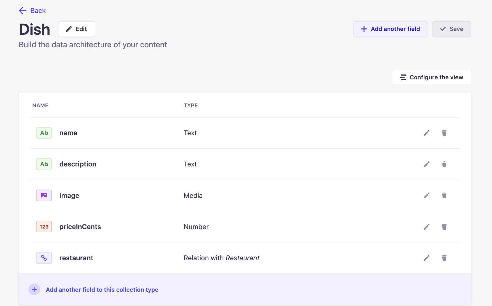
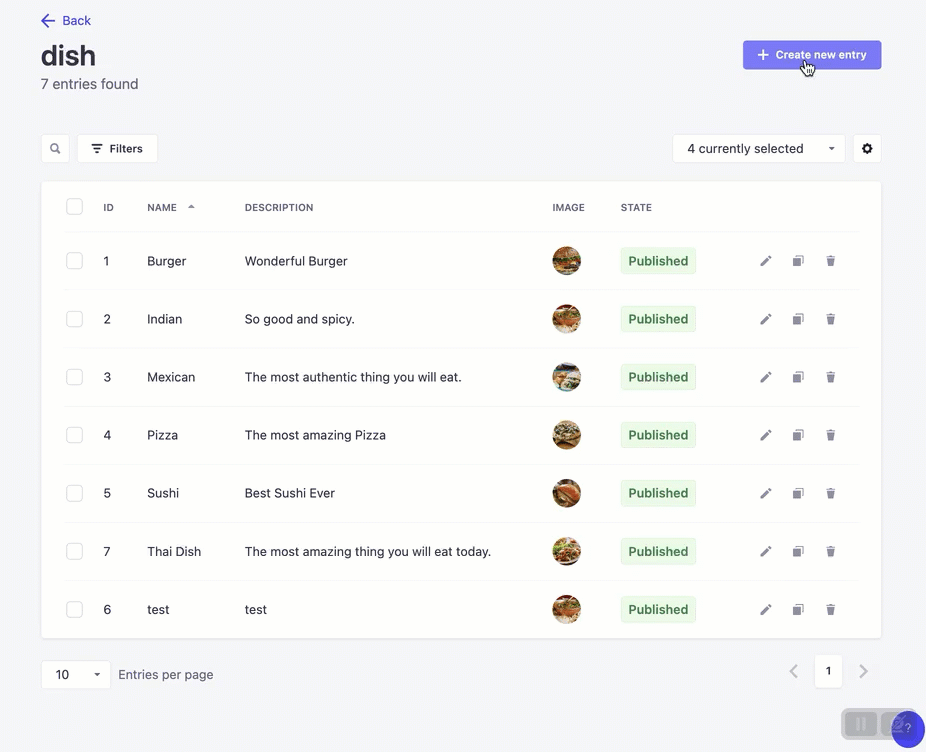

# Create a food ordering app with Strapi and Next.js 3/7

_619cc259ca.png>)

_This tutorial is part of the « Cooking a Deliveroo clone with_ [_Next.js_](https://strapi.io/integrations/nextjs-cms) _(React), GraphQL, Strapi and Stripe » tutorial series._
**Table of contents**

- 🏗️ [Setup](https://strapi.io/blog/nextjs-react-hooks-strapi-food-app-1) (part 1)
- 🏠 [Restaurants](https://strapi.io/blog/nextjs-react-hooks-strapi-restaurants-2) (part 2)
- 🍔 [Dishes](https://strapi.io/blog/nextjs-react-hooks-strapi-dishes-3) (part 3) - **Current**
- 🔐 [Authentication](https://strapi.io/blog/nextjs-react-hooks-strapi-auth-4) (part 4)
- 🛒 [Shopping Cart](https://strapi.io/blog/nextjs-react-hooks-strapi-shopping-cart-5) (part 5)
- 💵 [Order and Checkout](https://strapi.io/blog/nextjs-react-hooks-strapi-checkout-6) (part 6)
- 🚀 [Bonus: Deploy](https://strapi.io/blog/nextjs-react-hooks-strapi-deploy) (part 7)

**Note:** the source code is available on GitHub [here](https://github.com/divofred/food-ordering-app)

## **🍔 Dishes list**

Congratulations, in the last post you successfully displayed the list of restaurants!

**Define Content Type**
Every restaurant sells dishes, which also must be stored in the database. Now a new Content Type is needed named `dish`. Create a new [Content Type](http://localhost:1337/admin/plugins/content-type-builder) the same way with the following attributes:

- `name` with type `Text`.
- `description` with type `Text (Long Text)`.
- `image` with type `Media (Single media)`.
- `priceInCents` with type `Number` (Int).
- `restaurant` with type `Relation`: this one is a bit more specific. Our purpose here is to tell Strapi that every dish can be related to a restaurant. To do so, create a one-to-many relation, as below.

I decided to represent the price in cents to avoid rounding errors.

Relations in Strapi are shown below.


Here is the final result:


> Don’t forget to set up [Roles and Permission](http://localhost:1337/admin/settings/users-permissions/roles) for the **Dishes** Content type

**Add some entries**
Then, add some dishes from the Content Manager: [http://localhost:1337/admin/plugins/content-manager/dish](http://localhost:1337/admin/content-manager/collectionType/api::dish.dish?page=1&pageSize=10&sort=id:ASC). Make sure they all have an image and are linked to a restaurant. As shown below



**Display dishes**
A new route called `/restaurant` will be used to display the dishes for a particular restaurant using its `id`.
Now create a new folder in the pages folder named **restaurant** and create a file named **[id].js**. 

This file named **[id].js** is responsible for retrieving the restaurant’s **id** from the URL and using this **id** to get the dishes for that restaurant.
Path: `frontend/pages/restaurant/[id].js`

```jsx
import { gql, useQuery } from "@apollo/client";
import { centsToDollars } from "@/utils/centsToDollars";
import { useRouter } from "next/router";

import Image from "next/image";
import Loader from "@/components/Loader";

const GET_RESTAURANT_DISHES = gql`
  query ($id: ID!) {
    restaurant(id: $id) {
      data {
        id
        attributes {
          name
          dishes {
            data {
              id
              attributes {
                name
                description
                priceInCents
                image {
                  data {
                    attributes {
                      url
                    }
                  }
                }
              }
            }
          }
        }
      }
    }
  }
`;

function DishCard({ data }) {
  function handleAddItem() {
    // will add some logic here
  }

  return (
    <div className="w-full md:w-1/2 lg:w-1/3 p-4">
      <div className="h-full bg-gray-100 rounded-2xl">
        <Image
          className="w-full rounded-2xl"
          height={300}
          width={300}
          src={`${process.env.STRAPI_URL || "http://127.0.0.1:1337"}${
            data.attributes.image.data.attributes.url
          }`}
          alt=""
        />
        <div className="p-8">
          <div className="group inline-block mb-4" href="#">
            <h3 className="font-heading text-xl text-gray-900 hover:text-gray-700 group-hover:underline font-black">
              {data.attributes.name}
            </h3>
            <h2>${centsToDollars(data.attributes.priceInCents)}</h2>
          </div>
          <p className="text-sm text-gray-500 font-bold">
            {data.attributes.description}
          </p>
          <div className="flex flex-wrap md:justify-center -m-2">
            <div className="w-full md:w-auto p-2 my-6">
              <button
                className="block w-full px-12 py-3.5 text-lg text-center text-white font-bold bg-gray-900 hover:bg-gray-800 focus:ring-4 focus:ring-gray-600 rounded-full"
                onClick={handleAddItem}
              >
                + Add to Cart
              </button>
            </div>
          </div>
        </div>
      </div>
    </div>
  );
}

export default function Restaurant() {
  const router = useRouter();
  const { loading, error, data } = useQuery(GET_RESTAURANT_DISHES, {
    variables: { id: router.query.id },
  });

  if (error) return "Error Loading Dishes";
  if (loading) return <Loader />;
  if (data.restaurant.data.attributes.dishes.data.length) {
    const { restaurant } = data;

    return (
      <div className="py-6">
        <h1 className="text-4xl font-bold text-green-600">
          {restaurant.data.attributes.name}
        </h1>
        <div className="py-16 px-8 bg-white rounded-3xl">
          <div className="max-w-7xl mx-auto">
            <div className="flex flex-wrap -m-4 mb-6">
              {restaurant.data.attributes.dishes.data.map((res) => {
                return <DishCard key={res.id} data={res} />;
              })}
            </div>
          </div>
        </div>
      </div>
    );
  } else {
    return <h1>No Dishes Found</h1>;
  }
}
```

In the code above we are using a util function `centsToDollars` so let's create now.

Create a **utils** folder and inside create a file called **centsToDollars.js** and paste the following code:

```javascript
export function centsToDollars(cents) {
  const dollars = Math.floor(cents / 100);
  const centsRemainder = cents % 100;
  return dollars + "." + centsRemainder.toString().padStart(2, "0");
}
```

Once you’ve added the lines of code and hit save, head on to [localhost:3000](http://localhost:3000) to try out the application. You should be able to view the dishes attached to specific restaurants as seen in the GIF below.


🔐 In the next section, you will learn how to **authenticate users in your app** (register, logout & login): [https://strapi.io/blog/nextjs-react-hooks-strapi-auth-4](https://strapi.io/blog/nextjs-react-hooks-strapi-auth-4)
