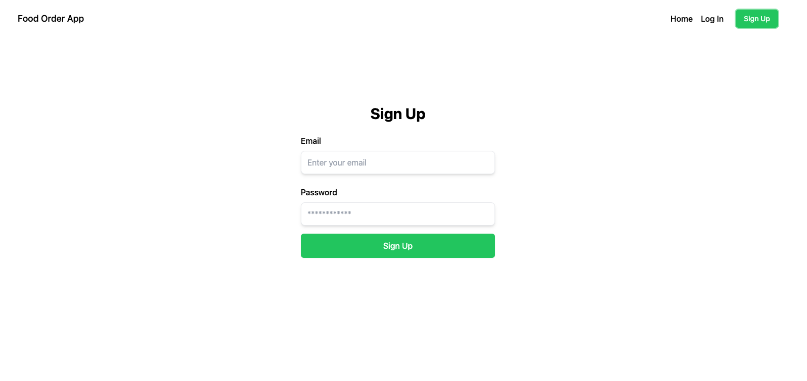

# Create a food ordering app with Strapi and Next.js 4/7

_ac01b5c04b.png>)

_This tutorial is part of the « Cooking a Deliveroo clone with Next.js (React), GraphQL, Strapi and Stripe » tutorial series._
**Table of contents**

- 🏗️ [Setup](https://strapi.io/blog/nextjs-react-hooks-strapi-food-app-1) (part 1)
- 🏠 [Restaurants](https://strapi.io/blog/nextjs-react-hooks-strapi-restaurants-2) (part 2)
- 🍔 [Dishes](https://strapi.io/blog/nextjs-react-hooks-strapi-dishes-3) (part 3)
- 🔐 [Authentication](https://strapi.io/blog/nextjs-react-hooks-strapi-auth-4) (part 4) - **Current**
- 🛒 [Shopping Cart](https://strapi.io/blog/nextjs-react-hooks-strapi-shopping-cart-5) (part 5)
- 💵 [Order and Checkout](https://strapi.io/blog/nextjs-react-hooks-strapi-checkout-6) (part 6)
- 🚀 [Bonus: Deploy](https://strapi.io/blog/nextjs-react-hooks-strapi-deploy) (part 7)

_Note: the source code is available on GitHub for_ [_Frontend_](https://github.com/divofred/food-ordering-app) and [Backend](https://github.com/divofred/strapi-app).

## **🔐 Authentication**

For authentication calls, we will use our graphql endpoint to register new users and login to existing users.

Strapi will return a JWT token and a user object, the former can be used to verify transactions on the server while the user object will display the username in the header bar.

The Strapi documentation on authentication can be found here: [Strapi Auth](https://docs.strapi.io/dev-docs/plugins/users-permissions#authentication)

Since we are going to be using GraphQL this is the [documentation](https://docs.strapi.io/dev-docs/plugins/graphql#usage-with-the-users--permissions-plugin) we will use.

Authentication with Next requires some additional consideration outside of a normal client-side authentication system because you have to be mindful of whether the code is being rendered on the client or the server.

We are going to keep in simple and handle it with `cookie-js` npm library that will store our user data.

Than we can use the jwt token that we store to revalidate out login user.

Strapi's built-in JWT authentication will be used in this tutorial. This will allow you to easily register, manage, login, and check users' status in our application.

Your backend admin panel will provide a GUI for user management out of the box to view, edit, activate, and delete users if needed.

**User Content-Type in Strapi:**


The premise of the JWT system is, a request will be sent to our GraphQL endpoint with a username, email, and password to register a new user.

```javascript
  mutation {
    register(input: { username: "username", email: "email", password: "password" }) {
      jwt
      user {
        username
        email
      }
    }
  }
```

This will return a user object and a JWT token in the user object will be stored in a cookie on the user's browser.

The same thing for logging in as a user with an email/password will return the same user object and JWT token if successful.

```javascript
  mutation {
    login(input: { identifier: "email", password: "password" }) {
      jwt
    }
  }
```

We can use the `me` query with a JWT as an authorization header to revalidate th e user if logged in. We can store the returned user data in a global context to share throughout the application.

Before creating the login and register forms, let's set up our global context and install `js-cookies` package.

To store our token we will use a package named **js-cookie** using the code, **Cookie.set(cookie)**.

Our token management will happen client-side only, however, your application could be developed differently in the real world.

Open the **frontend** directory in your terminal and install the following package:

```bash
  npm install js-cookie
```

**React Context**
To store the user object, you will need to create a global context state inside of the application. The context in React allows you to prevent prop-drilling multiple levels down and lets you grab and use the context state locally from a component.

This is a powerful construct in React, and definitely worth reading more info here: [React Context](https://react.dev/reference/react/useContext).

Now, create a file named **AuthContext.js** in the **context** folder. This file will store our user context.

```javascript
import { useState, createContext, useContext, useEffect } from "react";
import Router from "next/router";
import Cookie from "js-cookie";
import { gql } from "@apollo/client";
import { client } from "@/pages/_app.js";

const AuthContext = createContext();

export const AuthProvider = ({ children }) => {
  const [user, setUser] = useState(null);
  useEffect(() => {
    const fetchData = async () => {
      const userData = await getUser(client);
      setUser(userData);
    };
    fetchData();
  }, []);
  return (
    <AuthContext.Provider value={{ user, setUser }}>
      {children}
    </AuthContext.Provider>
  );
};

const getUser = async () => {
  const token = Cookie.get("token");
  if (!token) return null;
  const { data } = await client.query({
    query: gql`
      query {
        me {
          id
          email
          username
        }
      }
    `,
    context: {
      headers: {
        Authorization: `Bearer ${token}`,
      },
    },
  });
  return data.me;
};

export const useAuth = () => {
  const context = useContext(AuthContext);
  if (context === undefined)
    throw new Error("useAuth must be used within an AuthProvider");
  return context;
};
```

Now let's replace our code found the **\_app.js** file include our `AuthContext` provider.

```jsx
import { ApolloClient, ApolloProvider, InMemoryCache } from "@apollo/client";
import { AuthProvider } from "@/context/AuthContext";
import "@/styles/globals.css";
import Layout from "@/components/Layout";

const API_URL = process.env.STRAPI_URL || "http://localhost:1337";

export const client = new ApolloClient({
  uri: `${API_URL}/graphql`,
  cache: new InMemoryCache(),
  defaultOptions: {
    mutate: {
      errorPolicy: "all",
    },
    query: {
      errorPolicy: "all",
    },
  },
});

export default function App({ Component, pageProps }) {
  return (
    <ApolloProvider client={client}>
      <AuthProvider>
        <Layout>
          <Component {...pageProps} />
        </Layout>
      </AuthProvider>
    </ApolloProvider>
  );
}
```

Then update your header bar as well to display our username and a logout button if a user is signed in:

```jsx
import { useEffect } from "react";
import { useRouter } from "next/router";
import { useAuth } from "@/context/AuthContext";
import Cookie from "js-cookie";

import Head from "next/head";
import Link from "next/link";

function Navigation() {
  const { user, setUser } = useAuth();
  const router = useRouter();

  useEffect(() => {
    if (user) router.push("/");
  }, [user]);

  function handleLogout() {
    setUser(null);
    Cookie.remove("token");
    router.push("/");
  }

  return (
    <nav className="container mx-auto flex justify-between p-6 px-4">
      <div className="flex justify-between items-center w-full">
        <div className="xl:w-1/3">
          <Link
            className="block text-lg max-w-max ext-coolGray-500 hover:text-coolGray-900 font-medium"
            href="/"
          >
            Food Order App
          </Link>
        </div>

        <div className="xl:block xl:w-1/3">
          <div className="flex items-center justify-end">
            <Link
              className="text-coolGray-500 hover:text-coolGray-900 font-medium"
              href="/"
            >
              Home
            </Link>
            <div className="hxl:block">
              {user ? (
                <div className="flex items-center justify-end">
                  <span className="inline-block py-2 px-4 mr-2 leading-5 text-coolGray-500 hover:text-coolGray-900 bg-transparent font-medium rounded-md">
                    {user.username}
                  </span>
                  <button
                    className="inline-block py-2 px-4 text-sm leading-5 text-green-50 bg-green-500 hover:bg-green-600 font-medium focus:ring-2 focus:ring-green-500 focus:ring-opacity-50 rounded-md"
                    onClick={handleLogout}
                  >
                    Log Out
                  </button>
                </div>
              ) : (
                <div className="flex items-center justify-end">
                  <Link
                    className="inline-block py-2 px-4 mr-2 leading-5 text-coolGray-500 hover:text-coolGray-900 bg-transparent font-medium rounded-md"
                    href="/login"
                  >
                    Log In
                  </Link>
                  <Link
                    className="inline-block py-2 px-4 text-sm leading-5 text-green-50 bg-green-500 hover:bg-green-600 font-medium focus:ring-2 focus:ring-green-500 focus:ring-opacity-50 rounded-md"
                    href="/register"
                  >
                    Sign Up
                  </Link>
                </div>
              )}
            </div>
          </div>
        </div>
      </div>
    </nav>
  );
}

export default function Layout(props) {
  const title = "Welcome to Nextjs";

  return (
    <div>
      <Head>
        <title>{title}</title>
        <meta charSet="utf-8" />
        <meta name="viewport" content="initial-scale=1.0, width=device-width" />
      </Head>
      <Navigation />
      <div className="container mx-auto px-4">{props.children}</div>
    </div>
  );
}
```

Before we can test everything we need to add our signin and register logic. So first inside the **components** folder let's create a file called **Form.jsx** and add the following code.

```jsx
import React from "react";

export default function Form({
  title,
  buttonText,
  formData,
  setFormData,
  callback,
  error,
}) {
  return (
    <section className="py-24 md:py-32 bg-white">
      <div className="container px-4 mx-auto">
        <div className="max-w-sm mx-auto">
          <div className="mb-6 text-center">
            <h3 className="mb-4 text-2xl md:text-3xl font-bold">{title}</h3>
          </div>
          <form onSubmit={callback}>
            <div className="mb-6">
              <label
                className="block mb-2 text-coolGray-800 font-medium"
                htmlFor="email"
              >
                Email
              </label>
              <input
                id="email"
                className="appearance-none block w-full p-3 leading-5 text-coolGray-900 border border-coolGray-200 rounded-lg shadow-md placeholder-coolGray-400 focus:outline-none focus:ring-2 focus:ring-green-500 focus:ring-opacity-50"
                type="email"
                name="email"
                placeholder="Enter your email"
                value={formData.email}
                onChange={(e) =>
                  setFormData({ ...formData, email: e.target.value })
                }
              />
            </div>
            <div className="mb-4">
              <label
                className="block mb-2 text-coolGray-800 font-medium"
                htmlFor="password"
              >
                Password
              </label>
              <input
                id="password"
                className="appearance-none block w-full p-3 leading-5 text-coolGray-900 border border-coolGray-200 rounded-lg shadow-md placeholder-coolGray-400 focus:outline-none focus:ring-2 focus:ring-green-500 focus:ring-opacity-50"
                type="password"
                name="password"
                placeholder="************"
                value={formData.password}
                onChange={(e) =>
                  setFormData({ ...formData, password: e.target.value })
                }
              />
            </div>
            {error && (
              <div className="text-center my-4 text-red-600">
                Error: {error.message}
              </div>
            )}
            <button
              className="inline-block py-3 px-7 mb-6 w-full text-base text-green-50 font-medium text-center leading-6 bg-green-500 hover:bg-green-600 focus:ring-2 focus:ring-green-500 focus:ring-opacity-50 rounded-md shadow-sm"
              type="submit"
            >
              {buttonText}
            </button>
          </form>
        </div>
      </div>
    </section>
  );
}
```

**Register**

Now lets add the logic to handle our registration.

Add the following code inside the `/frontend/pages/register.js` file.

```jsx
import { useState } from "react";
import { useRouter } from "next/router";
import Form from "@/components/Form";
import { useAuth } from "@/context/AuthContext";
import Cookie from "js-cookie";
import { gql, useMutation } from "@apollo/client";

const REGISTER_MUTATION = gql`
  mutation Register($username: String!, $email: String!, $password: String!) {
    register(
      input: { username: $username, email: $email, password: $password }
    ) {
      jwt
      user {
        username
        email
      }
    }
  }
`;

export default function RegisterRoute() {
  const { setUser } = useAuth();
  const router = useRouter();

  const [formData, setFormData] = useState({ email: "", password: "" });
  const [registerMutation, { loading, error }] = useMutation(REGISTER_MUTATION);

  const handleRegister = async () => {
    const { email, password } = formData;
    const { data } = await registerMutation({
      variables: { username: email, email: email, password },
    });
    debugger;
    setUser(data.register.user);
    router.push("/");
    Cookie.set("token", data.register.jwt);
  };

  if (loading) return <div>Loading...</div>;

  return (
    <Form
      title="Sign Up"
      buttonText="Sign Up"
      formData={formData}
      setFormData={setFormData}
      callback={handleRegister}
      error={error}
    />
  );
}
```

You should get an output similar to the one shown below;



**Login**
Similar to the sign-up page, the sign-in page will use a token to log the user in and set the cookie.
Path: `frontend/pages/login.js`

```jsx
import { useState } from "react";
import { useRouter } from "next/router";
import Form from "@/components/Form";
import { useAuth } from "@/context/AuthContext";
import Cookie from "js-cookie";
import { gql, useMutation } from "@apollo/client";

const LOGIN_MUTATION = gql`
  mutation Login($identifier: String!, $password: String!) {
    login(input: { identifier: $identifier, password: $password }) {
      jwt
      user {
        username
        email
      }
    }
  }
`;

export default function LoginRoute() {
  const { setUser } = useAuth();
  const router = useRouter();

  const [formData, setFormData] = useState({ email: "", password: "" });
  const [loginMutation, { loading, error }] = useMutation(LOGIN_MUTATION);

  const handleLogin = async () => {
    const { email, password } = formData;
    const { data } = await loginMutation({
      variables: { identifier: email, password },
    });
    if (data?.login.user) {
      setUser(data.login.user);
      router.push("/");
      Cookie.set("token", data.login.jwt);
    }
  };

  if (loading) return <div>Loading...</div>;

  return (
    <Form
      title="Login"
      buttonText="Login"
      formData={formData}
      setFormData={setFormData}
      callback={handleLogin}
      error={error}
    />
  );
}
```

You should get an output similar to the one shown below;


Your user registration, login, and logout should be set correctly!


🛒 In the next section, you will learn how to **create a full-featured shopping cart**: [https://strapi.io/blog/nextjs-react-hooks-strapi-shopping-cart-5](https://strapi.io/blog/nextjs-react-hooks-strapi-shopping-cart-5)
