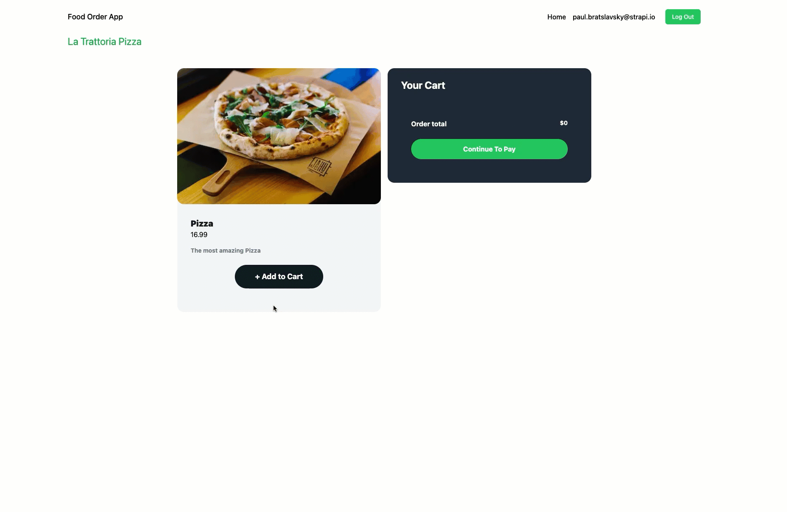

# Create a food ordering app with Strapi and Next.js 5/7

_ad8b2cd7ea.png>)

_This tutorial is part of the « Cooking a Deliveroo clone with Next.js (React), GraphQL, Strapi and Stripe » tutorial series._
**Table of contents**

- 🏗️ [Setup](https://strapi.io/blog/nextjs-react-hooks-strapi-food-app-1) (part 1)
- 🏠 [Restaurants](https://strapi.io/blog/nextjs-react-hooks-strapi-restaurants-2) (part 2)
- 🍔 [Dishes](https://strapi.io/blog/nextjs-react-hooks-strapi-dishes-3) (part 3)
- 🔐 [Authentication](https://strapi.io/blog/nextjs-react-hooks-strapi-auth-4) (part 4)
- 🛒 [Shopping Cart](https://strapi.io/blog/nextjs-react-hooks-strapi-shopping-cart-5) (part 5) - **Current**
- 💵 [Order and Checkout](https://strapi.io/blog/nextjs-react-hooks-strapi-checkout-6) (part 6)
- 🚀 [Bonus: Deploy](https://strapi.io/blog/nextjs-react-hooks-strapi-deploy) (part 7)

**Note:** the source code is available on GitHub [here](https://github.com/divofred/food-ordering-app)

## **🛒 Shopping Cart**

These dishes look so tasty! What if you could add some of them to a shopping cart?

That exactly what we are going to do. We going to add the following card component and allow users add items to their cart.



First things first, let's update our context provider to allow us to save our items in the cart.

## **React Context**

To keep track of the items added to the cart across pages you will use the React Context API.

This will prevent having to prop drill the items multiple levels deep. The context will allow you to manage the state of items that will be re-used on the checkout page.

The only thing React Context will not take care of for you is preserving items through a page refresh, for that, we will save out cart items to a cookie.

You can also save it to a DB and restore them, but that is not want we are going to do here today.

Update the code in your `AppContext.js` file found in our `context` folder with the code below.

```jsx
import { useState, createContext, useContext, useEffect } from "react";
import Cookie from "js-cookie";
import { gql } from "@apollo/client";
import { client } from "@/pages/_app.js";

const AppContext = createContext();

export const AppProvider = ({ children }) => {
  const cartCookie =
    Cookie.get("cart") !== "undefined" ? Cookie.get("cart") : null;

  const [user, setUser] = useState(null);
  const [showCart, setShowCart] = useState(true);
  const [cart, setCart] = useState(
    cartCookie ? JSON.parse(cartCookie) : { items: [], total: 0 }
  );

  useEffect(() => {
    const fetchData = async () => {
      const userData = await getUser();
      setUser(userData);
    };
    fetchData();
  }, []);

  useEffect(() => {
    Cookie.set("cart", JSON.stringify(cart));
  }, [cart]);

  const addItem = (item) => {
    let newItem = cart.items.find((i) => i.id === item.id);
    if (!newItem) {
      const newItem = {
        quantity: 1,
        ...item,
      };
      setCart((prevCart) => ({
        items: [...prevCart.items, newItem],
        total: prevCart.total + item.attributes.priceInCents,
      }));
    } else {
      setCart((prevCart) => ({
        items: prevCart.items.map((i) =>
          i.id === newItem.id ? { ...i, quantity: i.quantity + 1 } : i
        ),
        total: prevCart.total + item.attributes.priceInCents,
      }));
    }
  };

  const removeItem = (item) => {
    let newItem = cart.items.find((i) => i.id === item.id);
    if (newItem.quantity > 1) {
      setCart((prevCart) => ({
        items: prevCart.items.map((i) =>
          i.id === newItem.id ? { ...i, quantity: i.quantity - 1 } : i
        ),
        total: prevCart.total - item.attributes.priceInCents,
      }));
    } else {
      setCart((prevCart) => ({
        items: prevCart.items.filter((i) => i.id !== item.id),
        total: prevCart.total - item.attributes.priceInCents,
      }));
    }
  };

  const resetCart = () => {
    setCart({ items: [], total: 0 });
  };

  return (
    <AppContext.Provider
      value={{
        user,
        setUser,
        cart,
        addItem,
        removeItem,
        resetCart,
        showCart,
        setShowCart,
      }}
    >
      {children}
    </AppContext.Provider>
  );
};

const getUser = async () => {
  const token = Cookie.get("token");
  if (!token) return null;
  const { data } = await client.query({
    query: gql`
      query {
        me {
          id
          email
          username
        }
      }
    `,
    context: {
      headers: {
        Authorization: `Bearer ${token}`,
      },
    },
  });
  return data.me;
};

export const useAppContext = () => {
  const context = useContext(AppContext);
  if (context === undefined)
    throw new Error("useAppContext must be used within an AppProvider");
  return context;
};
```

This will allow us to save and remove our cart to state via `addItem` and `removeItem` function.

Now that we updated our context and added new cart methods, lets navigate to `pages/restaurants/[id].jsx` and add the following changes.  

``` jsx
 const { addItem, setShowCart } = useAppContext();

  function handleAddItem() {
    addItem(data);
    setShowCart(true);
  }
```

The final code should look as follows:

``` jsx
import { gql, useQuery } from "@apollo/client";
import { centsToDollars } from "@/utils/centsToDollars";
import { useRouter } from "next/router";
import { useAppContext } from "@/context/AppContext";

import Image from "next/image";
import Loader from '@/components/Loader';

const GET_RESTAURANT_DISHES = gql`
  query ($id: ID!) {
    restaurant(id: $id) {
      data {
        id
        attributes {
          name
          dishes {
            data {
              id
              attributes {
                name
                description
                priceInCents
                image {
                  data {
                    attributes {
                      url
                    }
                  }
                }
              }
            }
          }
        }
      }
    }
  }
`;

function DishCard({ data }) {
  const { addItem, setShowCart } = useAppContext();

  function handleAddItem() {
    addItem(data);
    setShowCart(true);
  }

  return (
    <div className="w-full md:w-1/2 lg:w-1/3 p-4">

      <div className="h-full bg-gray-100 rounded-2xl">
        <Image
          className="w-full rounded-2xl"
          height={300}
          width={300}
          src={`${process.env.STRAPI_URL || "http://localhost:1337"}${
            data.attributes.image.data.attributes.url
          }`}
          alt=""
        />
        <div className="p-8">
          <div className="group inline-block mb-4" href="#">
            <h3 className="font-heading text-xl text-gray-900 hover:text-gray-700 group-hover:underline font-black">
              {data.attributes.name}
            </h3>
            <h2>${centsToDollars(data.attributes.priceInCents)}</h2>
          </div>
          <p className="text-sm text-gray-500 font-bold">
            {data.attributes.description}
          </p>
          <div className="flex flex-wrap md:justify-center -m-2">
            <div className="w-full md:w-auto p-2 my-6">
              <button
                className="block w-full px-12 py-3.5 text-lg text-center text-white font-bold bg-gray-900 hover:bg-gray-800 focus:ring-4 focus:ring-gray-600 rounded-full"
                onClick={handleAddItem}
              >
                + Add to Cart
              </button>
            </div>
          </div>
        </div>
      </div>
    </div>
  );
}

export default function Restaurant() {
  const router = useRouter();
  const { loading, error, data } = useQuery(GET_RESTAURANT_DISHES, {
    variables: { id: router.query.id },
  });

  if (error) return "Error Loading Dishes";
  if (loading) return <Loader />;
  if (data.restaurant.data.attributes.dishes.data.length) {
    const { restaurant } = data;

    return (
      <div className='py-6'>
        <h1 className="text-4xl font-bold text-green-600">
          {restaurant.data.attributes.name}
        </h1>
        <div className="py-16 px-8 bg-white rounded-3xl">
          <div className="max-w-7xl mx-auto">
            <div className="flex flex-wrap -m-4 mb-6">
              {restaurant.data.attributes.dishes.data.map((res) => {
                return <DishCard key={res.id} data={res} />;
              })}
            </div>
          </div>
        </div>
      </div>
    );
  } else {
    return <h1>No Dishes Found</h1>;
  }
}

```

Now let's create our **cart** component.

## **Cart Component**

Create a new file in the `components` folder named `Cart.jsx` and add the following code.

Path: `frontend/components/Cart.jsx`

```jsx
import { useAppContext } from "@/context/AppContext";
import { useRouter } from "next/router";
import { centsToDollars } from "@/utils/centsToDollars";

function CartItem({ data }) {
  const { addItem, removeItem } = useAppContext();
  const { quantity, attributes } = data;

  return (
    <div className="p-6 flex flex-wrap justify-between border-b border-blueGray-800">
      <div className="w-2/4">
        <div className="flex flex-col h-full">
          <h6 className="font-bold text-white mb-1">{attributes.name}</h6>
          <span className="block pb-4 mb-auto font-medium text-gray-400">
            {quantity} x ${centsToDollars(attributes.priceInCents)}
          </span>
        </div>
      </div>
      <div className="w-1/4">
        <div className="flex flex-col items-end h-full">
          <div className="flex justify-between">
            <button
              className="mr-2 inline-block mb-auto font-medium text-sm text-gray-400 hover:text-gray-200"
              onClick={() => removeItem(data)}
            >
              Remove
            </button>
            <button
              className="inline-block mb-auto font-medium text-sm text-gray-400 hover:text-gray-200"
              onClick={() => addItem(data)}
            >
              Add
            </button>
          </div>
          <span className="block mt-2 text-sm font-bold text-white">
            ${centsToDollars(attributes.priceInCents * quantity)}
          </span>
        </div>
      </div>
    </div>
  );
}

export default function Cart() {
  const router = useRouter();
  const { user, cart, showCart, setShowCart } = useAppContext();
  const total = cart.total;
  const displayTotal = Math.abs(total);

  function loginRedirect() {
    router.push("/login");
  }

  function cartRedirect() {
    setShowCart(false);
    router.push("/checkout");
  }

  return (
    <section className="fixed right-20 top-[242px]">
      <div className="relative">
        <button
          onClick={() => setShowCart((prevState) => !prevState)}
          className="absolute right-0 z-10 bg-green-500 text-white p-3 rounded-full hover:bg-yellow-500 items-center"
        >
          <svg
            width="24"
            height="24"
            viewBox="0 0 16 18"
            fill="none"
            xmlns="http://www.w3.org/2000/svg"
          >
            <path
              d="M11.3334 8.16667V4.83333C11.3334 2.99238 9.84099 1.5 8.00004 1.5C6.15909 1.5 4.66671 2.99238 4.66671 4.83333V8.16667M2.16671 6.5H13.8334L14.6667 16.5H1.33337L2.16671 6.5Z"
              stroke="currentColor"
              strokeWidth="1.5"
              strokeLinecap="round"
              strokeLinejoin="round"
            ></path>
          </svg>
        </button>
        {showCart && (
          <div className="rounded-3xl co bg-gray-800">
            <div className="max-w-lg pt-6 pb-8 px-8 mx-auto">
              <div className="flex mb-10 items-center justify-between">
                <h6 className="font-bold text-2xl text-white mb-0">
                  Your Cart
                </h6>
              </div>

              <div>
                {cart.items
                  ? cart.items.map((item, index) => {
                      if (item.quantity > 0) {
                        return <CartItem key={index} data={item} />;
                      }
                    })
                  : null}
              </div>
              <div className="p-6">
                <div className="flex mb-6 content-center justify-between">
                  <span className="font-bold text-white">Order total</span>
                  <span className="text-sm font-bold text-white">
                    ${centsToDollars(displayTotal)}
                  </span>
                </div>
                <button
                  onClick={() => (user ? cartRedirect() : loginRedirect())}
                  className="inline-block w-full px-6 py-3 text-center font-bold text-white bg-green-500 hover:bg-green-600 transition duration-200 rounded-full"
                >
                  {user ? "Continue To Pay" : "Login to Order"}
                </button>
              </div>
            </div>
          </div>
        )}
      </div>
    </section>
  );
}
```

## **Putting Things Together**

Now let's connect all these things together.

Update the `/components/Layout.js` file to use our newly created **Cart** component.

Path: `/components/Layout.js`

We are using `dynamic` import to deffer hydration you can read more on this [here](https://nextjs.org/docs/advanced-features/dynamic-import)

This was necessary to avoid `hydration miss-match error`. Late in the post I will show another way to avoid this error.

You can read about this error [here](https://github.com/vercel/next.js/discussions/35773) 

```jsx
import dynamic from "next/dynamic";
import { useRouter } from "next/router";
import { useAppContext } from "@/context/AppContext";
import Cookie from "js-cookie";
const Cart = dynamic(() => import("@/components/Cart"), { ssr: false });

import Head from "next/head";
import Link from "next/link";

function Navigation() {
  const { user, setUser } = useAppContext();
  const router = useRouter();

  function handleLogout() {
    setUser(null);
    Cookie.remove("token");
    router.push("/");
  }

  return (
    <header className="bg-green-800">
      <nav className="flex justify-between p-6 px-4">
        <div className="flex justify-between items-center w-full mx-16">
          <div className="xl:w-1/3">
            <Link
              className="block text-2xl max-w-max text-white font-medium"
              href="/"
            >
              Food Order App
            </Link>
          </div>

          <div className="xl:block xl:w-1/3">
            <div className="flex items-center justify-end">
              <Link
                className="text-gray-50  hover:text-yellow-200 font-bold"
                href="/"
              >
                Home
              </Link>

              <div className="hxl:block">
                {user ? (
                  <div className="flex items-center justify-end">
                    <span className="inline-block py-2 px-4 mr-2 leading-5 text-gray-50  hover:text-gray-100 bg-transparent font-medium rounded-md">
                      {user.username}
                    </span>
                    <button
                      className="inline-block py-2 px-4 text-sm leading-5 text-green-50 bg-green-500 hover:bg-green-600 font-medium focus:ring-2 focus:ring-green-500 focus:ring-opacity-50 rounded-md"
                      onClick={handleLogout}
                    >
                      Log Out
                    </button>
                  </div>
                ) : (
                  <div className="flex items-center justify-end">
                    <Link
                      className="inline-block py-2 px-4 mr-2 leading-5 text-gray-50  hover:text-yellow-200 font-bold bg-transparent rounded-md"
                      href="/login"
                    >
                      Log In
                    </Link>
                    <Link
                      className="inline-block py-2 px-4 text-sm leading-5 text-green-50 bg-green-600 hover:bg-green-700 font-medium focus:ring-2 focus:ring-green-500 focus:ring-opacity-50 rounded-md"
                      href="/register"
                    >
                      Sign Up
                    </Link>
                  </div>
                )}
              </div>
            </div>
          </div>
        </div>
      </nav>
    </header>
  );
}

export default function Layout(props) {
  const title = "Welcome to Next JS";

  return (
    <div>
      <Head>
        <title>{title}</title>
        <meta charSet="utf-8" />
        <meta name="viewport" content="initial-scale=1.0, width=device-width" />
      </Head>
      <Navigation />
      <Cart />
      <div className="container mx-auto px-4">{props.children}</div>
    </div>
  );
}
```

Now if you refresh the page you should see the Cart component to the right of the dishes.

Your Layout header should also update with the username of the logged in user and show a logout button if you are logged-in.

Good job, let's finish the last step for ordering the food!

💵 In the next section, you will learn how to set up **Stripe for checkout and create orders**: [https://strapi.io/blog/nextjs-react-hooks-strapi-checkout-6](https://strapi.io/blog/nextjs-react-hooks-strapi-checkout-6).
