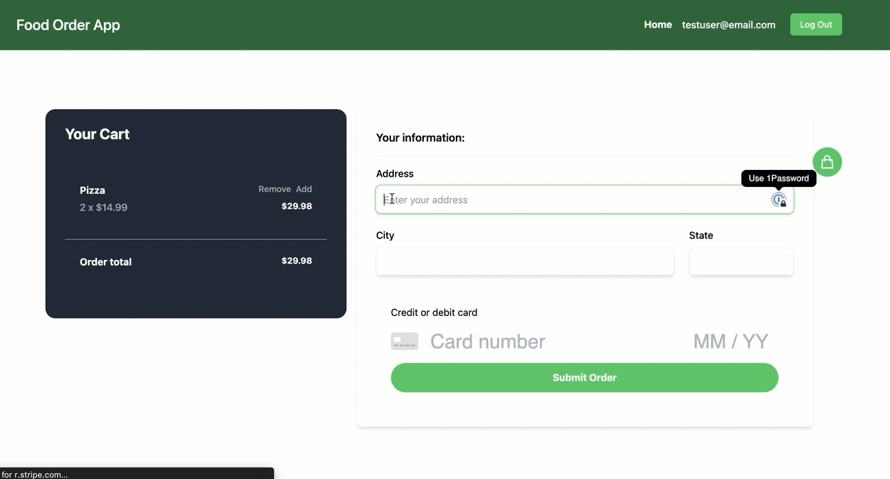
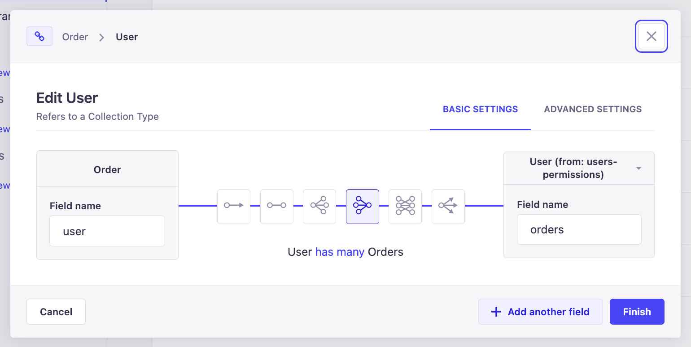
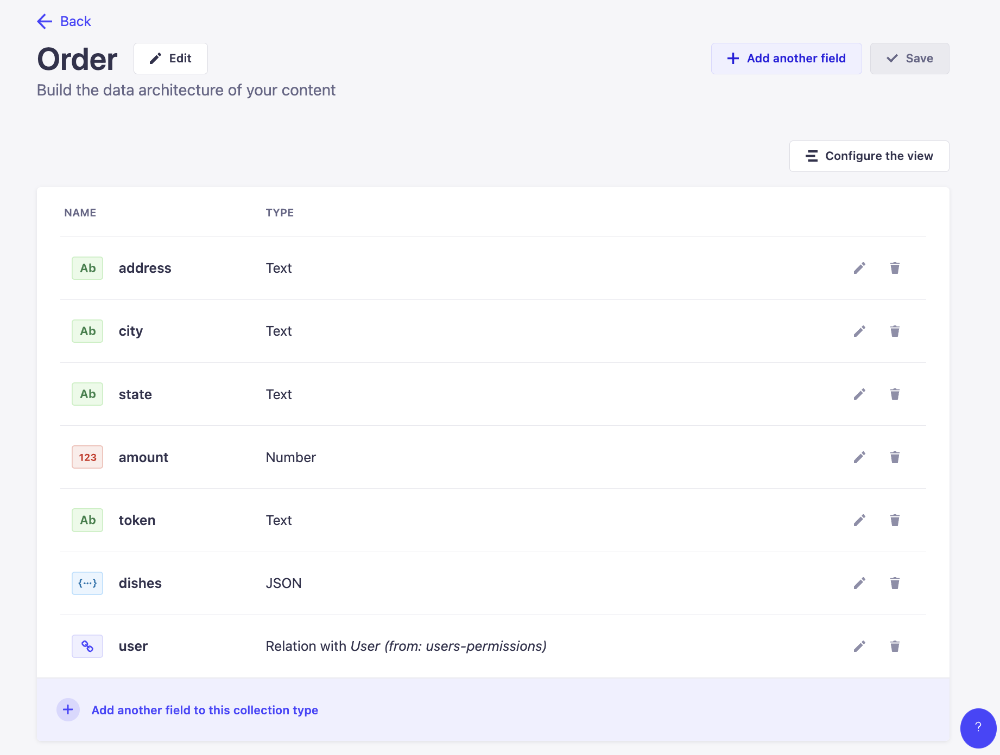
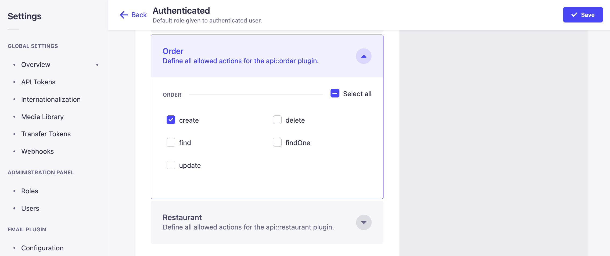
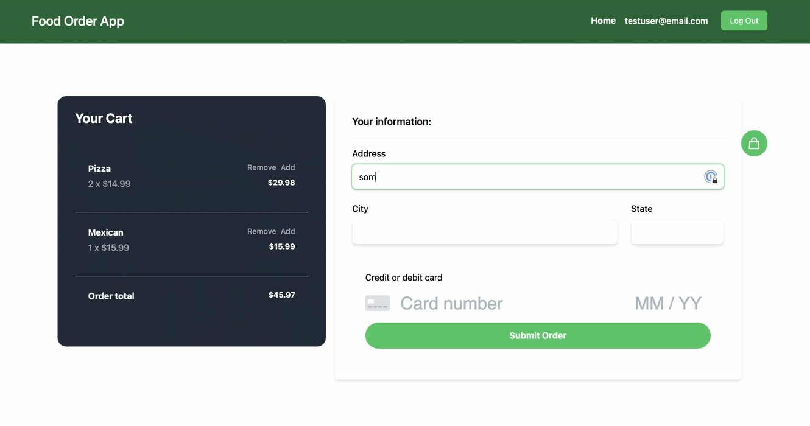

# Create a food ordering app with Strapi and Next.js 6/7

_6219e06f2b.png>)

_This tutorial is part of the « Cooking a Deliveroo clone with Next.js (React), GraphQL, Strapi and Stripe » tutorial series._
**Table of contents**

- 🏗️ [Setup](https://strapi.io/blog/nextjs-react-hooks-strapi-food-app-1) (part 1)
- 🏠 [Restaurants](https://strapi.io/blog/nextjs-react-hooks-strapi-restaurants-2) (part 2)
- 🍔 [Dishes](https://strapi.io/blog/nextjs-react-hooks-strapi-dishes-3) (part 3)
- 🔐 [Authentication](https://strapi.io/blog/nextjs-react-hooks-strapi-auth-4) (part 4)
- 🛒 [Shopping Cart](https://strapi.io/blog/nextjs-react-hooks-strapi-shopping-cart-5) (part 5)
  - 💵 [Order and Checkout](https://strapi.io/blog/nextjs-react-hooks-strapi-checkout-6) (part 6) - **Current**
- 🚀 [Bonus: Deploy](https://strapi.io/blog/nextjs-react-hooks-strapi-deploy) (part 7)

**Note:** the source code is available on GitHub [here](https://github.com/divofred/food-ordering-app)

## **💵 Order and Checkout**

You must start starving... I am sure you want to be able to order!



**Define Content Type**
You need to store the orders in the database, so a new Content Type will be created in Strapi.
Same process as usual:

- Navigate to the Content-Type Builder (http://localhost:1337/admin/plugins/content-type-builder).
- Click on `+ Create new collection type`.
- Set `order` as a name.
- Click on `Add New Field` and create the followings fields:
  - `address` with type `Text`.
  - `city` with type `Text`.
  - `state` with type `Text`.
  - `amount` with type `Number` (Int).
  - `token` with type `Text`.
  - `dishes` with type `JSON`.
  - `user` relation with user.



- Click on Finish then Save.



**Allow access**
To create new orders from the client, you are going to hit the `create` endpoint of the `order` API. To allow access, navigate to the Roles section ([http://localhost:1337/admin/plugins/users-permissions](http://localhost:1337/admin/settings/users-permissions/roles)), select the `authenticated` role, tick the `order/create` checkbox, and save.



**Stripe setup**
In this section, you will need Stripe API keys.

To get them, [create a Stripe account](https://dashboard.stripe.com/register) or [log in to Stripe](https://dashboard.stripe.com/login) then navigate to [https://dashboard.stripe.com/account/apikeys](https://dashboard.stripe.com/account/apikeys).

**Add logic**
If you have already used Stripe, you probably know the credit card information does not go through your backend server. Instead, the credit card information is sent to the Stripe API (ideally using their SDK).

Then, your front end receives a token that can be used to charge credit cards.

The `id` must be sent to your backend which will create the Stripe charge.

Not passing the credit card information through your server relieves you the responsibility to meet complicated data handling compliance, and is just far easier than worrying about securely storing sensitive data.

Install the `stripe` package in the **backend** directory:

```bash
    npm i stripe --save
```

To integrate the Stripe logic, you need to update the `create` charge endpoint in our Strapi API.

You can learn more on how to customize Strapi controllers [here](https://docs.strapi.io/dev-docs/backend-customization/controllers)

To do so, edit `backend/src/api/order/controllers/order.js` and replace its content with the following code:

> Make sure to insert your stripe secret key (sk\_) at the top where it instructs.

Path: `*/backend/src/api/order/controllers/order.js*`

```js
"use strict";
const stripe = require("stripe")("sk_test_4eC39HqLyjWDarjtT1zdp7dc");

/**
 *  order controller
 */
const { createCoreController } = require("@strapi/strapi").factories;
module.exports = createCoreController("api::order.order", ({ strapi }) => ({
  async create(ctx) {
    const user = ctx.state.user;

    if (!user) {
      return ctx.unauthorized("You are not authorized!");
    }

    console.log(ctx.request.body.data);
    console.log(ctx.state.user.id);
    console.log("order controller");

    const { address, amount, dishes, token, city, state } =
      ctx.request.body.data;

    try {
      // Charge the customer
      await stripe.charges.create({
        amount: amount,
        currency: "usd",
        description: `Order ${new Date()} by ${ctx.state.user.id}`,
        source: token,
      });

      // Create the order
      const order = await strapi.service("api::order.order").create({
        data: {
          amount,
          address,
          dishes,
          city,
          state,
          token,
          user: ctx.state.user.id,
        },
      });
      return order;
    } catch (err) {
      // return 500 error
      console.log("err", err);
      ctx.response.status = 500;
      return {
        error: { message: "There was a problem creating the charge" },
        address,
        amount,
        dishes,
        token,
        city,
        state,
      };
    }
  },
}));
```

Do not forget to restart the Strapi server.

To interact with the Stripe API, the [react-stripe-js](https://github.com/stripe/react-stripe-js) library will be used, which will give Elements components to style the credit card form and submit the information properly to Stripe.

**Checkout page**
Now install the stripe UI elements for the frontend. Open the frontend directory in the terminal and run the following command:

```bash
    npm install @stripe/react-stripe-js @stripe/stripe-js
```

Now let's create our checkout form, in the pages directory create a new file called `checkout.js` and add the following code.

```jsx
import { Elements } from "@stripe/react-stripe-js";
import { loadStripe } from "@stripe/stripe-js";
import { useInitialRender } from "@/utils/useInitialRender";
import CheckoutForm from "@/components/CheckoutForm";
import CheckoutCart from "@/components/CheckoutCart";
const stripePromise = loadStripe("pk_test_TYooMQauvdEDq54NiTphI7jx");

export default function Checkout() {
  const initialRender = useInitialRender();
  if (!initialRender) return null;

  return (
    <section className="container mx-auto py-24">
      <div className="grid grid-cols-5 gap-4">
        <div className="col-span-2">
          <CheckoutCart />
        </div>
        <div className="col-span-3">
          <Elements stripe={stripePromise}>
            <CheckoutForm />
          </Elements>
        </div>
      </div>
    </section>
  );
}
```

You will notice that we are using some components from Stripe, you can learn more [here](https://stripe.com/docs/stripe-js/react).

As well as useInitialRender, before creating this function, the reason we are using this, is to check if the initial client side code rendered, otherwise we would get `hydration miss-match error`.

Let's create the following file `useInitialRender.js` inside our `utils` folder and paste the following code:

```jsx
import { useState, useEffect } from "react";
export const useInitialRender = () => {
  const [initialRenderComplete, setInitialRenderComplete] = useState(false);

  useEffect(() => {
    if (!initialRenderComplete) setInitialRenderComplete(true);
  }, [initialRenderComplete]);

  return initialRenderComplete;
};
```

Next, we are going to create the `CheckoutForm` and `CheckoutCart` components to capture the credit card info and pass it to Stripe using the react-stripe-elements package:

In the the components directory create a file named name **CheckoutForm.jsx.**

Once done, add the following code:
Path: `frontend/components/CheckoutForm.jsx`

```jsx
import React, { useState } from "react";
import Cookie from "js-cookie";
import { client } from "@/pages/_app.js";
import { gql } from "@apollo/client";
import { CardElement, useStripe, useElements } from "@stripe/react-stripe-js";
import { useAppContext } from "@/context/AppContext";
import { useRouter } from "next/router";
import { useInitialRender } from "@/utils/useInitialRender";

const options = {
  style: {
    base: {
      fontSize: "32px",
      color: "#52a635",
      "::placeholder": {
        color: "#aab7c4",
      },
    },
    invalid: {
      color: "#9e2521",
    },
  },
};

const INITIAL_STATE = {
  address: "",
  city: "",
  state: "",
  error: null,
};

export default function CheckoutForm() {
  const [data, setData] = useState(INITIAL_STATE);
  const [loading, setLoading] = useState(false);
  const { user, cart, resetCart, setShowCart } = useAppContext();

  const initialRender = useInitialRender();

  const stripe = useStripe();
  const elements = useElements();
  const router = useRouter();

  if (!initialRender) return null;

  function onChange(e) {
    const updateItem = (data[e.target.name] = e.target.value);
    setData({ ...data, updateItem });
  }

  async function submitOrder(e) {
    e.preventDefault();
    const cardElement = elements.getElement(CardElement);
    const token = await stripe.createToken(cardElement);

    if (data.address === "") {
      setData({ ...data, error: { message: "Address is required" } });
      return;
    }

    if (data.city === "") {
      setData({ ...data, error: { message: "City is required" } });
      return;
    }

    if (data.state === "") {
      setData({ ...data, error: { message: "State is required" } });
      return;
    }

    if (token.error) {
      setData({ ...data, error: { message: token.error.message } });
      return;
    }

    const jwt = Cookie.get("token");

    try {
      setLoading(true);

      const { data: response } = await client.mutate({
        mutation: gql`
          mutation CreateOrder(
            $amount: Int
            $dishes: JSON
            $address: String
            $city: String
            $state: String
            $token: String
          ) {
            createOrder(
              data: {
                amount: $amount
                dishes: $dishes
                address: $address
                city: $city
                state: $state
                token: $token
              }
            ) {
              data {
                id
                attributes {
                  token
                }
              }
            }
          }
        `,
        variables: {
          amount: cart.total,
          dishes: cart.items,
          address: data.address,
          city: data.city,
          state: data.state,
          token: token.token.id,
        },
        context: {
          headers: {
            Authorization: `Bearer ${jwt}`,
          },
        },
      });

      if (response.createOrder.data) {
        alert("Transaction Successful, continue your shopping");
        setData(INITIAL_STATE);
        resetCart();
        setShowCart(true);
        router.push("/");
      }
    } catch (error) {
      setData({ ...data, error: { message: error.message } });
    } finally {
      setLoading(false);
    }
  }

  return (
    <form>
      <div className="bg-white shadow-md rounded-lg p-8">
        <h5 className="text-lg font-semibold">Your information:</h5>
        <hr className="my-4" />
        <div className="flex mb-6">
          <div className="flex-1">
            <label
              className="block mb-2 test-gray-800 font-medium"
              htmlFor="address"
            >
              Address
            </label>
            <input
              id="address"
              htmlFor="address"
              className="appearance-none block w-full p-3 leading-5 text-gray-900 border border-gray-200 rounded-lg shadow-md placeholder-text-gray-400 focus:outline-none focus:ring-2 focus:ring-green-500 focus:ring-opacity-50"
              type="text"
              name="address"
              onChange={onChange}
              placeholder="Enter your address"
            />
          </div>
        </div>
        <div className="flex mb-6">
          <div className="flex-1 mr-6">
            <label
              htmlFor="city"
              className="block mb-2 test-gray-800 font-medium"
            >
              City
            </label>
            <input
              type="text"
              name="city"
              id="city"
              onChange={onChange}
              className="appearance-none block w-full p-3 leading-5 text-gray-900 border border-gray-200 rounded-lg shadow-md placeholder-text-gray-400 focus:outline-none focus:ring-2 focus:ring-green-500 focus:ring-opacity-50"
            />
          </div>

          <div className="w-1/4">
            <label
              htmlFor="state"
              className="block mb-2 test-gray-800 font-medium"
            >
              State
            </label>
            <input
              type="text"
              name="state"
              id="state"
              onChange={onChange}
              className="appearance-none block w-full p-3 leading-5 text-gray-900 border border-gray-200 rounded-lg shadow-md placeholder-text-gray-400 focus:outline-none focus:ring-2 focus:ring-green-500 focus:ring-opacity-50"
            />
          </div>
        </div>
        {cart.items.length > 0 ? (
          <div className="p-6">
            <div>Credit or debit card</div>
            <div className="my-4">
              <CardElement options={options} />
            </div>
            <button
              className="inline-block w-full px-6 py-3 text-center font-bold text-white bg-green-500 hover:bg-green-600 transition duration-200 rounded-full"
              onClick={(e) => (user ? submitOrder(e) : router.push("/login"))}
              disabled={loading}
            >
              {loading ? "Submitting" : "Submit Order"}
            </button>
          </div>
        ) : (
          <div className="text-center">
            <h1 className="text-2xl font-semibold">Your cart is empty</h1>
            <p className="text-gray-500">
              Add some items to your cart to continue
            </p>
          </div>
        )}
        <div>
          {data.error && (
            <div className="bg-red-100 border border-red-400 text-red-700 px-4 py-3 rounded relative">
              <strong className="font-bold">Error!</strong>{" "}
              <span className="block sm:inline">{data.error.message}</span>
            </div>
          )}
        </div>
      </div>
    </form>
  );
}
```

Here is what happens in our submitOrder function.

This is an asynchronous function named submitOrder that is triggered when clicking the order button and performs the following steps:

1. Prevent the default form submission behavior using e.preventDefault().
2. Obtain the Stripe card element using elements.getElement(CardElement) which is from the Stripe API.
3. Use the stripe.createToken() method to create a token from the card element. The await keyword is used to wait for the token creation to complete before proceeding.
4. If the address, city, or state fields are empty, set the error message using setData({...data, error: { message: "..." }}) and return from the function.
5. If there is an error with the token creation, set the error message using setData({...data, error: { message: token.error.message }}) and return from the function.
6. Get the JWT (JSON Web Token) from a cookie using Cookie.get("token").
7. Use a GraphQL mutation to create an order by calling client.mutate(). The mutation includes the order details (amount, dishes, address, city, state, and token) and the JWT in the headers for authentication.
8. If the order is created successfully, display an alert, reset the form data, clear the cart, show the cart, and redirect to the home page using router.push("/").
9. If there is an error during the GraphQL mutation or any other step, set the error message using setData({...data, error: { message: error.message }}).
10. Finally, set the loading state to false using setLoading(false).

In summary, this code is a function for submitting an order that uses the Stripe API to create a payment token and GraphQL to create an order. It also handles errors and sets loading states accordingly.

Now let's create our `CheckoutCart` component. Create a file inside our **components** folder called `CheckoutCart.jsx`

Path: `frontend/components/CheckoutCart.jsx`

```jsx
import { useAppContext } from "@/context/AppContext";
import { centsToDollars } from "@/utils/centsToDollars";

function CartItem({ data }) {
  const { addItem, removeItem } = useAppContext();
  const { quantity, attributes } = data;
  return (
    <div className="p-6 flex flex-wrap justify-between border-b border-blueGray-800">
      <div className="w-2/4">
        <div className="flex flex-col h-full">
          <h6 className="font-bold text-white mb-1">{attributes.name}</h6>
          <span className="block pb-4 mb-auto font-medium text-gray-400">
            {quantity} x ${centsToDollars(attributes.priceInCents)}
          </span>
        </div>
      </div>
      <div className="w-1/4">
        <div className="flex flex-col items-end h-full">
          <div className="flex justify-between">
            <button
              className="mr-2 inline-block mb-auto font-medium text-sm text-gray-400 hover:text-gray-200"
              onClick={() => removeItem(data)}
            >
              Remove
            </button>
            <button
              className="inline-block mb-auto font-medium text-sm text-gray-400 hover:text-gray-200"
              onClick={() => addItem(data)}
            >
              Add
            </button>
          </div>
          <span className="block mt-2 text-sm font-bold text-white">
            ${centsToDollars(attributes.priceInCents * quantity)}
          </span>
        </div>
      </div>
    </div>
  );
}

export default function CheckoutCart() {
  const { cart } = useAppContext();
  const total = cart.total;
  const displayTotal = Math.abs(total);

  return (
    <div className="rounded-2xl co bg-gray-800">
      <div className="max-w-lg pt-6 pb-8 px-8 mx-auto bg-blueGray-900">
        <div className="flex mb-10 items-center justify-between">
          <h6 className="font-bold text-2xl text-white mb-0">Your Cart</h6>
        </div>

        <div>
          {cart.items
            ? cart.items.map((item, index) => {
                if (item.quantity > 0) {
                  return <CartItem key={index} data={item} />;
                }
              })
            : null}
        </div>
        <div className="p-6">
          <div className="flex mb-6 content-center justify-between">
            <span className="font-bold text-white">Order total</span>
            <span className="text-sm font-bold text-white">
              ${centsToDollars(displayTotal)}
            </span>
          </div>
        </div>
      </div>
    </div>
  );
}
```
---
Now let's test our order form out, for a test credit card number you can just use `4242 4242 4242 4242`, that should work for you.

Now if you select a dish and click **order**, you should see:



We are able to place an order. Great job.
Bon appétit!

In the final section we will explore how to deploy our frontend and backend application. See you there.
