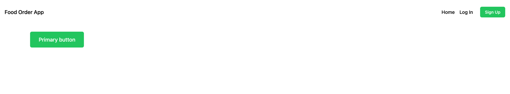
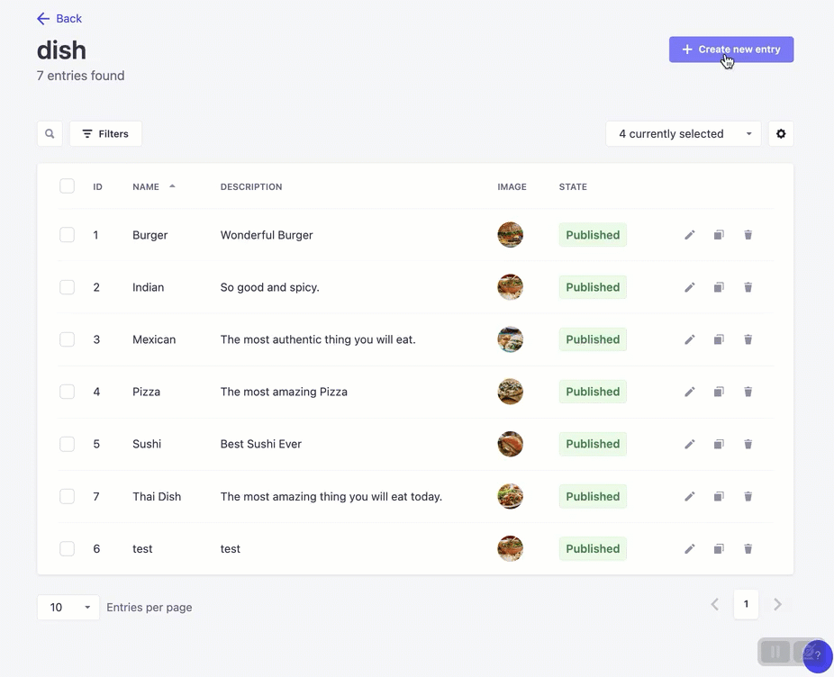
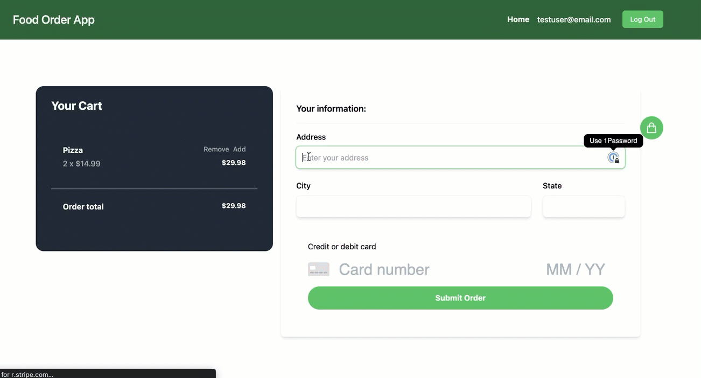
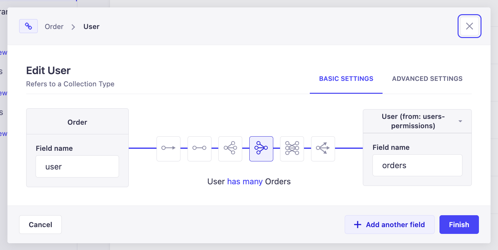
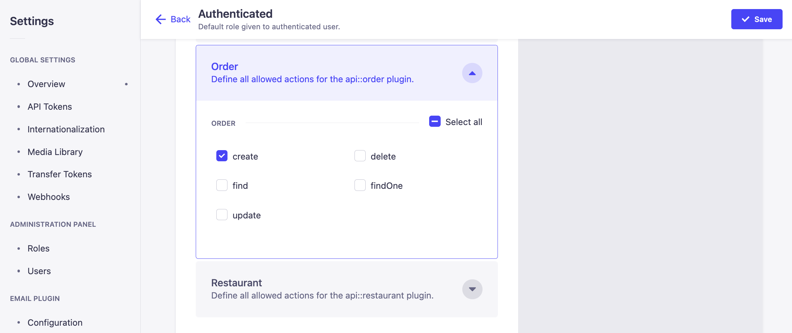

# Create a food ordering app with Strapi and Next.js 1/7


_Updated April 2023_
This tutorial will walk you through how to use [Next.js](https://strapi.io/integrations/nextjs-cms) to power your UI, complete using **GraphQL, Stripe, Strapi, and Next** to developing a full-stack application complete with the powerful Strapi (Headless CMS) powering the backend.

Get ready to develop an **online food ordering app, more info on the tech stack here:** [**Next.js**](https://strapi.io/integrations/nextjs-cms)**,** [**GraphQL**](https://graphql.org/)**,** [**Stripe**](http://stripe.com/) **and** [**Strapi**](https://strapi.io/)!

From sign up to order, you are going to let users discover restaurants, dishes and order meals.

Your app will be complete with user login, registration, authentication, image upload, restaurant creation, dish creation, cart functionality, and stripe order integration.

The **demo of the final result** should make you hungry:


_Note: the source code is available on GitHub for_ [_Frontend_](https://github.com/divofred/food-ordering-app) and [Backend](https://github.com/divofred/strapi-app).
Screenshots of final product:


**Strapi:**
[**Strapi**](https://strapi.io) [](https://github.com/strapi/strapi)is the most advanced open-source **Node.js Headless Content Management System** used to build scalable, secure, production-ready APIs quickly and efficiently saving developers countless hours of development.

With its extensible plugin system, it provides an enormous set of built-in features: Admin Panel, Authentication & Permissions management, Content Management, API Generator, etc. **Strapi is 100% open-source,** which means:

- Strapi is **completely free**.
- You can **host it on your servers**, so you own the data.
- It is entirely **customizable and extensible**, thanks to the plugin system.

**Next.js:**
[**Next**](https://nextjs.org/) [](https://strapi.io/integrations/nextjs-cms)is a lightweight **React** framework to create server-rendered applications. Next.js will take care of the heavy lifting of the application build such as _code splitting, HMR (hot module replacement) SSR (server-side rendering)_ and allow us to focus on writing the code, not our build config.

**GraphQL:**
[**GraphQL**](https://github.com/graphql) is a query language also developed by Facebook to allow the front end of an application to easily query an application's API. Each query requests only the data needed to be rendered by the current view. This allows the developer to craft a great user experience across _multiple devices and screen sizes_.

**Stripe:**
[**Stripe**](https://github.com/stripe) is one payment processor for applications today. Stripe has developed the tools and SDKs to allow developers to craft and integrate _secure, compliant payment processing_ into any app with ease.

## **Table of contents**

- 🏗️ [Setup](https://strapi.io/blog/nextjs-react-hooks-strapi-food-app-1) (part 1) - **Current**
- 🏠 [Restaurants](https://strapi.io/blog/nextjs-react-hooks-strapi-restaurants-2) (part 2)
- 🍔 [Dishes](https://strapi.io/blog/nextjs-react-hooks-strapi-dishes-3) (part 3)
- 🔐 [Authentication](https://strapi.io/blog/nextjs-react-hooks-strapi-auth-4) (part 4)
- 🛒 [Shopping Card](https://strapi.io/blog/nextjs-react-hooks-strapi-shopping-cart-5) (part 5)
- 💵 [Order and Checkout](https://strapi.io/blog/nextjs-react-hooks-strapi-checkout-6) (part 6)
- 🚀 [Bonus: Deploy](https://strapi.io/blog/nextjs-react-hooks-strapi-deploy) (part 7)

## **🏗️ Setup**

**Next**
To set up [Next.js](https://strapi.io/integrations/nextjs-cms) you will need an empty directory to install the dependencies and host our project root.

This project will be split into two parts, one for the front end (Next.js code) and one for the backend (Strapi code).

1. Run the code below in your terminal to create this project’s source folder.

```bash
  mkdir next-food-delivery
```

2. Next, Open the `next-food-delivery` folder in your favourite code editor, VS Code preferably and run the following code in the integrated terminal.

```bash
  npx create-next-app@latest frontend
```

You should see the following output.

```bash
  ➜ npx create-next-app@latest frontend
  Need to install the following packages:
  create-next-app@13.3.4
  Ok to proceed? (y) y
```

Here are the options I selected for this tutorial, make sure you chose the same ones to follow along:

```bash
➜ next-food-delivery npx create-frontend frontend
  Need to install the following packages:
  create-next-app@13.3.4
  Ok to proceed? (y) y
✔ Would you like to use TypeScript with this project? … No
✔ Would you like to use ESLint with this project? … Yes
✔ Would you like to use `src/` directory with this project? … No
✔ Would you like to use experimental `app/` directory with this project? … No
✔ What import alias would you like configured? … @/*
Creating a new Next.js app
```

The following code will create a folder named `frontend` and set up NextJS.

First things first, let's set up our environment variables to avoid hard coding the API URL and having to update it on every deployment.
Create a new file in the project’s directory and add the following code.

```bash
  cd frontend
  touch .env.development
```

Inside `/.env.development` development file add the following code:

```bash
    NEXT_PUBLIC_API_URL='http://localhost:1337'
```

**Adding Tailwind**
This tutorial makes use of [Next And Tailwind](https://tailwindcss.com/docs/guides/nextjs) to implement Tailwind into the application.

**Tailwind** is a front-end library to easily style your application. This will take care of the heavy lifting on the front end.
Open your terminal in the `frontend` directory and run the following command:

note: if you selected to use tailwind in the previous option you can omit this step.

```bash
  npm install -D tailwindcss postcss autoprefixer
  npx tailwindcss init -p
```

**Configure your template paths**
Add the following code inside the `tailwind.config.js` file.

```javascript
/** @type {import('tailwindcss').Config} */
module.exports = {
  content: [
    "./app/**/*.{js,ts,jsx,tsx}",
    "./pages/**/*.{js,ts,jsx,tsx}",
    "./components/**/*.{js,ts,jsx,tsx}",
  ],
  theme: {
    extend: {},
  },
  plugins: [],
};
```

**Add the Tailwind directives to your CSS**
Add the @tailwind directives by replacing your css inside the `styles/globals.css` file with the following.

```css
@tailwind base;
@tailwind components;
@tailwind utilities;
```

If the above was created for you automatically, you can remove all of the other css after the @tailwind directives.

We are importing our CSS in the `_app.js` file inside the **pages directory** . This will allow us to share our CSS and and Layout component across all pages.

> You can read more about the `_app.js` handling [here](https://nextjs.org/docs/advanced-features/custom-app)

1. Open the **pages** folder, select the `_app.js` to see where we are importing our CSS.

Path: `/frontend/pages/_app.js`

```javascript
import "@/styles/globals.css";

export default function App({ Component, pageProps }) {
  return <Component {...pageProps} />;
}
```

1. Now replace the code inside the **index.js** file with the following to test out **tailwind** CSS.

Path: `frontend/pages/index.js`

```jsx
import Head from "next/head";

export default function Home() {
  return (
    <>
      <Head>
        <title>Create Next App</title>
        <meta name="description" content="Generated by create next app" />
        <meta name="viewport" content="width=device-width, initial-scale=1" />
        <link rel="icon" href="/favicon.ico" />
      </Head>
      <main className="mx-auto container">
        <button className="inline-block py-3 px-7 w-full md:w-auto text-lg leading-7 text-green-50 bg-green-500 hover:bg-green-600 font-medium text-center focus:ring-2 focus:ring-green-500 focus:ring-opacity-50 border border-transparent rounded-md shadow-sm">
          Primary button
        </button>
      </main>
    </>
  );
}
```

2. Next, open your terminal in the frontend directory and start the next application by running the command below.

```bash
   npm run dev
```

Open this URL, [localhost:3000](http://localhost:3000), in your favourite browser to view the next app. You should get an output similar to the one below.


**Designing the page**
Now that we have Tailwind running inside of our Next project, we can style the shared frontend components like the nav bar.

3. Create a folder in the **frontend** directory named **components** to store all the components for the next application and create a file named **Layout.jsx.**

Add the following code bellow:

Path: `/frontend/components/Layout.js`

```jsx
import Head from "next/head";
import Link from "next/link";

function Navigation() {
  return (
    <nav className="container mx-auto flex justify-between p-6 px-4">
      <div className="flex justify-between items-center w-full">
        <div className="xl:w-1/3">
          <Link
            className="block text-lg max-w-max ext-coolGray-500 hover:text-coolGray-900 font-medium"
            href="/"
          >
            Food Order App
          </Link>
        </div>

        <div className="xl:block xl:w-1/3">
          <div className="flex items-center justify-end">
            <Link
              className="text-coolGray-500 hover:text-coolGray-900 font-medium"
              href="/"
            >
              Home
            </Link>
            <Link
              className="inline-block py-2 px-4 mr-2 leading-5 text-coolGray-500 hover:text-coolGray-900 bg-transparent font-medium rounded-md"
              href="/login"
            >
              Log In
            </Link>
            <Link
              className="inline-block py-2 px-4 text-sm leading-5 text-green-50 bg-green-500 hover:bg-green-600 font-medium focus:ring-2 focus:ring-green-500 focus:ring-opacity-50 rounded-md"
              href="/register"
            >
              Sign Up
            </Link>
          </div>
        </div>
      </div>
    </nav>
  );
}

export default function Layout(props) {
  const title = "Welcome to Nextjs";

  return (
    <div>
      <Head>
        <title>{title}</title>
        <meta charSet="utf-8" />
        <meta name="viewport" content="initial-scale=1.0, width=device-width" />
      </Head>
      <Navigation />
      <div className="container mx-auto px-4">{props.children}</div>
    </div>
  );
}
```

4. Edit the `_app.js` file to use the new Layout component across the application:

Path: `/frontend/frontend/pages/_app.js`

```jsx
import "@/styles/globals.css";
import Layout from "@/components/Layout";

export default function App({ Component, pageProps }) {
  return (
    <Layout>
      <Component {...pageProps} />
    </Layout>
  );
}
```

You should now have a shared header bar across all your pages, as shown in the output below:



**Creating the Login and Sign up page**

1. Create two additional pages in the **pages** folder to allow users to sign in and sign up named **login.js** and **register.js,** respectively.
2. Populate the files with the following code.

Path: `/frontend/pages/register.js`

```jsx
/* pages/register.js */
export default function RegisterRoute() {
  return <h1>Sign Up</h1>;
}
```

Path: `/frontend/pages/login.js`

```jsx
/* pages/login.js */

export default function LoginRoute() {
  return <h1>Log In</h1>;
}
```

You should now see the routes at [http://localhost:3000/login](http://localhost:3000/login) and [http://localhost:3000/register](http://localhost:3000/register)

**Setting up the database**
This tutorial uses [PostgreSQL](https://www.postgresql.org/) as the database for this application.

1. Head on to the [download page](https://www.postgresql.org/download) for PostgreSQL and follow the prompts to install PostgreSQL on your local machine.
   > This tutorial uses Windows 10 as its operating system.
2. Search and open up _PgAdmin_ in the start menu of your computer. _PgAdmin_ will help create and manage your _Strapi database._
   > PgAdmin is installed when you install [PostgreSQL](https://www.postgresql.org/download/).
3. When PgAdmin opens, you will be prompted to put in the password entered during the installation as shown below.
   

4. On the left navigation bar, click on **Servers** and click on **PostgreSQL** **14**.
   

5. Right-click on **Databases,** hover over **Create** and click on **Database**.
   

6. You can name the database anything you desire, but, in this tutorial, the name of the database is **nextapp**. Once you're done naming the database, hit save.
   

The name of the database, **nextapp**, will be shown on the left navigation bar. Clicking on it will prompt a drop-down as shown below:


**Install Strapi**
Having a frontend is good, but your app needs a backend to manage users, restaurants, dishes and orders. To make the magic happen, let's create a Strapi API.

> Please use version >=[Node 9](https://nodejs.org/en/download) and have PostgreSQL installed and running on your machine.

**Create Strapi server**

1. Open your terminal in the `next-food-delivery`'s directory and run the following code to create a **Strapi** application.

```bash
  npx create-strapi-app@latest backend
```

2. Running the above command for the first time will prompt you with steps to install **Strapi** Choose **custom** settings and follow the installation steps. Make sure to provide your credential for the postgres database that we created earlier.

Here are my options:

```bash
➜  next-food-delivery npx create-strapi-app@latest backend
? Choose your installation type Custom (manual settings)
? Choose your preferred language JavaScript
? Choose your default database client postgres
? Database name: nextapp
? Host: 127.0.0.1
? Port: 5432
? Username: postgres
? Password: ***********
? Enable SSL connection: No

Creating a project with custom database options.
```

3. Once the installation is complete, you should see the following output.

```bash
Available commands in your project:

  yarn develop
  Start Strapi in watch mode. (Changes in Strapi project files will trigger a server restart)

  yarn start
  Start Strapi without watch mode.

  yarn build
  Build Strapi admin panel.

  yarn strapi
  Display all available commands.

You can start by doing:

```

You can start your project by running the following command:

```bash
  cd backend
  npm run develop
```

4. Once the application starts you should see the following.


5. As shown in the output below, Strapi wants to know a bit about you. You can choose to answer or decide to skip this question.


6. Open the **Backend** folder, click on **backend**, and select **database.js** from the **config** folder to see your configuration file.

You should see the following code that was automatically setup for you when we created your Strapi project with your postgres credentials.

```javascript
//
 postgres: {
      connection: {
        connectionString: env('DATABASE_URL'),
        host: env('DATABASE_HOST', 'localhost'),
        port: env.int('DATABASE_PORT', 5432),
        database: env('DATABASE_NAME', 'strapi'),
        user: env('DATABASE_USERNAME', 'strapi'),
        password: env('DATABASE_PASSWORD', 'strapi'),
        ssl: env.bool('DATABASE_SSL', false) && {
          key: env('DATABASE_SSL_KEY', undefined),
          cert: env('DATABASE_SSL_CERT', undefined),
          ca: env('DATABASE_SSL_CA', undefined),
          capath: env('DATABASE_SSL_CAPATH', undefined),
          cipher: env('DATABASE_SSL_CIPHER', undefined),
          rejectUnauthorized: env.bool(
            'DATABASE_SSL_REJECT_UNAUTHORIZED',
            true
          ),
        },
        schema: env('DATABASE_SCHEMA', 'public'),
      },
      pool: { min: env.int('DATABASE_POOL_MIN', 2), max: env.int('DATABASE_POOL_MAX', 10) },
    },
//

```

You can find your database variables within your .env file.

Good job, you successfully set up both Next.js and Strapi projects! 🎉

🏠 In the next section, you will learn how to display the **list of restaurants**: [https://strapi.io/blog/nextjs-react-hooks-strapi-restaurants-2](https://strapi.io/blog/nextjs-react-hooks-strapi-restaurants-2).


# **Create a food ordering app with Strapi and Next.js 2/7**

_f1ddc0e6bb.png>)

What we are building:


_This tutorial is part of the « Cooking a Deliveroo clone with Next.js (_[_React_](https://strapi.io/integrations/react-cms)_), GraphQL, Strapi and Stripe » tutorial series._
**Table of contents**

- 🏗️ [Setup](https://strapi.io/blog/nextjs-react-hooks-strapi-food-app-1) (part 1)
- 🏠 [Restaurants](https://strapi.io/blog/nextjs-react-hooks-strapi-restaurants-2) (part 2) - **Current**
- 🍔 [Dishes](https://strapi.io/blog/nextjs-react-hooks-strapi-dishes-3) (part 3)
- 🔐 [Authentication](https://strapi.io/blog/nextjs-react-hooks-strapi-auth-4) (part 4)
- 🛒 [Shopping Cart](https://strapi.io/blog/nextjs-react-hooks-strapi-shopping-cart-5) (part 5)
- 💵 [Order and Checkout](https://strapi.io/blog/nextjs-react-hooks-strapi-checkout-6) (part 6)
- 🚀 [Bonus: Deploy](https://strapi.io/blog/nextjs-react-hooks-strapi-deploy) (part 7)

_Note: the source code is available on GitHub for_ [_Frontend_](https://github.com/divofred/food-ordering-app) and [Backend](https://github.com/divofred/strapi-app).

## **🏠 Restaurants list**

First of all, the list of restaurants needs to be displayed in our web app. Of course, this list is going to be managed through our API.
**Define Content Type**
A Content-Type also called a `model`, is a type of data. The Straps API includes by default, the `user` Content Type. Right now a restaurant Content Type is needed, so the new Content Type is going to be, as you already guessed, `restaurant` (Content-Types are always singular).
Here are the required steps:

1. Navigate to the Content Type Builder in the sidebar ([http://localhost:1337/admin/plugins/content-type-builder](http://localhost:1337/admin/plugins/content-type-builder)).
2. Click on `+ Create new collection type`.
3. Set `restaurant` as the **Display name**.
   

- Click on `Continue` and create the followings fields:
  - `Text` called `name`.
  - Click on Add another field, select `Rich Text` and name it `description`.
  - Create another field with type `Media` and name `image`.
- Click on Finish
- Click on Save, the server should restart automatically.
  

At this point, your server should have automatically restarted and a new link `Restaurants` appears in the left menu.
**Add some entries**
Well done! You created your first Content Type. The next step is to add some restaurants to your database. To do so, click on **Content Manager** then click on **Restaurant** in the left menu (http://localhost:1337/admin/content-manager/collectionType/api::restaurant.restaurant).
You are now in the Content Manager plugin: an auto-generated user interface that let you see and edit entries.
Create a restaurant:

- Click on `Create New Entry`.
- Give it a name, a description and select an image.
- Save it.
- Publish it.

Create as many restaurants as you would like to see in your apps.


**Allow access**
Having the items in the database is great. Being able to request them from an API is even better. As you already know, Strapi's mission is to create API (I have got a super secret anecdote for you: its name is coming from Boot**strap** your **API** 😮).
When you were creating your `restaurant` Content-Type, Strapi created on the backend, a few sets of files in `api/restaurant`.
These files include the logic to expose a fully customizable CRUD API. The `find` route is available at [http://localhost:1337/api/restaurants](http://localhost:1337/api/restaurants). Visiting this [URL](http://localhost:1337/api/restaurants) will send a **403** forbidden error, as seen in the output below.


This is normal (Strapi APIs are secured by design).
Don't worry, making this route accessible is super intuitive.

- Navigate to **Settings** then [**Roles & Permissions**](http://localhost:1337/admin/settings/users-permissions/roles).
- Click on the `Public` role.
- Tick the `find` and `findone` checkboxes in the `Restaurant` section.
- Do the same for `Authenticated`
- Save.
  

Now go back to [http://localhost:1337/api/restaurants](http://localhost:1337/api/restaurants): at this point, you should be able to see your list of restaurants as shown in the output below.


**Enabling GraphQL**
By default, APIs generated with Strapi are REST endpoints. The endpoints can easily be integrated into GraphQL endpoints using the integrated [GraphQL plugin](https://market.strapi.io/plugins/@strapi-plugin-graphql).

1. To get started with [GraphQL](https://market.strapi.io/plugins/@strapi-plugin-graphql) with Strapi, Open your **backend** folder in your terminal and run the command below to install GraphQL.

```bash
   npm install @strapi/plugin-graphql
```

**Make sure to restart your strapi server if it does not auto restart**
Restart your server, go to [http://localhost:1337/graphql](http://localhost:1337/graphql) and try this query:

    query Restaurant {
      restaurants {
        data {
          id
          attributes {
            name
            image {
              data {
                attributes {
                  url
                }
              }
            }
          }
        }
      }
    }

You should get an output similar to the one below.


**Display restaurants**
You are doing great. Let's now see how we can display our restaurants in our Next JS app.


Install Apollo in the **frontend of our application**, navigate to the `/frontend` folder in a terminal window and type the following:

```bash
  npm install @apollo/client graphql
```

We can implement our apollo client directly within the `_app.js` file by replacing it with the following code.

```jsx
import { ApolloClient, ApolloProvider, InMemoryCache } from "@apollo/client";
import "@/styles/globals.css";
import Layout from "@/components/Layout";

const API_URL = process.env.STRAPI_URL || "http://localhost:1337";

export const client = new ApolloClient({
  uri: `${API_URL}/graphql`,
  cache: new InMemoryCache(),
  defaultOptions: {
    mutate: {
      errorPolicy: "all",
    },
    query: {
      errorPolicy: "all",
    },
  },
});

export default function App({ Component, pageProps }) {
  return (
    <ApolloProvider client={client}>
      <Layout>
        <Component {...pageProps} />
      </Layout>
    </ApolloProvider>
  );
}
```

Open the **components** folder and create a file named **RestaurantList.jsx** and add the following code.

Path: `frontend/components/RestaurantList.jsx`

```jsx
import { gql, useQuery } from "@apollo/client";
import Link from "next/link";
import Image from "next/image";
import Loader from "./Loader";

const QUERY = gql`
  {
    restaurants {
      data {
        id
        attributes {
          name
          description
          image {
            data {
              attributes {
                url
              }
            }
          }
        }
      }
    }
  }
`;

function RestaurantCard({ data }) {
  return (
    <div className="w-full md:w-1/2 lg:w-1/3 p-4">
      <div className="h-full bg-gray-100 rounded-2xl">
        <Image
          className="w-full rounded-2xl"
          height={300}
          width={300}
          src={`${process.env.STRAPI_URL || "http://localhost:1337"}${
            data.attributes.image.data[0].attributes.url
          }`}
          alt=""
        />
        <div className="p-8">
          <h3 className="mb-3 font-heading text-xl text-gray-900 hover:text-gray-700 group-hover:underline font-black">
            {data.attributes.name}
          </h3>
          <p className="text-sm text-gray-500 font-bold">
            {data.attributes.description}
          </p>
          <div className="flex flex-wrap md:justify-center -m-2">
            <div className="w-full md:w-auto p-2 my-6">
              <Link
                className="block w-full px-12 py-3.5 text-lg text-center text-white font-bold bg-gray-900 hover:bg-gray-800 focus:ring-4 focus:ring-gray-600 rounded-full"
                href={`/restaurant/${data.id}`}
              >
                View
              </Link>
            </div>
          </div>
        </div>
      </div>
    </div>
  );
}

function RestaurantList(props) {
  const { loading, error, data } = useQuery(QUERY);

  if (error) return "Error loading restaurants";
  if (loading) return <Loader />;

  if (data.restaurants.data && data.restaurants.data.length) {
    const searchQuery = data.restaurants.data.filter((query) =>
      query.attributes.name.toLowerCase().includes(props.query.toLowerCase())
    );

    if (searchQuery.length != 0) {
      return (
        <div className="py-16 px-8 bg-white rounded-3xl">
          <div className="max-w-7xl mx-auto">
            <div className="flex flex-wrap -m-4 mb-6">
              {searchQuery.map((res) => {
                return <RestaurantCard key={res.id} data={res} />;
              })}
            </div>
          </div>
        </div>
      );
    } else {
      return <h1>No Restaurants Found</h1>;
    }
  }
  return <h5>Add Restaurants</h5>;
}
export default RestaurantList;
```

We have to make one more change in the `next.config.js` file in order to make our images show up when using next js **Image** component. 

Let's replace it with the following code.

Path: `frontend/next.config.js`

```javascript
/** @type {import('next').NextConfig} */
const nextConfig = {
  reactStrictMode: true,
  images: {
    remotePatterns: [
      {
        protocol: "http",
        hostname: "localhost",
        port: "1337",
        pathname: "/uploads/**",
      },
    ],
  },
};

module.exports = nextConfig;
```

You will have to stop and restart your frontend project before the changes take place.

Now let's replace `/pages/index.js` file with the code below to display the Restaurant list and a search bar to filter the restaurants.

Path: `frontend/pages/index.js`

```jsx
import { useState } from "react";
import RestaurantList from "@/components/RestaurantList";
import Head from "next/head";

export default function Home() {
  const [query, setQuery] = useState("");
  return (
    <>
      <Head>
        <title>Create Next App</title>
        <meta name="description" content="Generated by create next app" />
        <meta name="viewport" content="width=device-width, initial-scale=1" />
        <link rel="icon" href="/favicon.ico" />
      </Head>
      <main className="mx-auto container m-6">
        <div className="mb-6">
          <input
            className="appearance-none block w-full p-3 leading-5 text-coolGray-900 border border-coolGray-200 rounded-lg shadow-md placeholder-coolGray-400 focus:outline-none focus:ring-2 focus:ring-green-500 focus:ring-opacity-50"
            type="text"
            placeholder="Search restaurants"
            onChange={(e) => setQuery(e.target.value)}
          />
        </div>
        <RestaurantList query={query} />
      </main>
    </>
  );
}
```

Don't forget to create our `Loader` component.

In components folder create a **Loader.jsx** file and add the following code:

``` jsx
export default function Loader() {
  return (
    <div className="absolute inset-0 flex items-center justify-center z-50  bg-opacity-40 bg-green-500">
    <div role="status">
      <svg
        aria-hidden="true"
        className="inline w-8 h-8 mr-2 text-gray-200 animate-spin dark:text-gray-600 fill-green-400"
        viewBox="0 0 100 101"
        fill="none"
        xmlns="http://www.w3.org/2000/svg"
      >
        <path
          d="M100 50.5908C100 78.2051 77.6142 100.591 50 100.591C22.3858 100.591 0 78.2051 0 50.5908C0 22.9766 22.3858 0.59082 50 0.59082C77.6142 0.59082 100 22.9766 100 50.5908ZM9.08144 50.5908C9.08144 73.1895 27.4013 91.5094 50 91.5094C72.5987 91.5094 90.9186 73.1895 90.9186 50.5908C90.9186 27.9921 72.5987 9.67226 50 9.67226C27.4013 9.67226 9.08144 27.9921 9.08144 50.5908Z"
          fill="currentColor"
        />
        <path
          d="M93.9676 39.0409C96.393 38.4038 97.8624 35.9116 97.0079 33.5539C95.2932 28.8227 92.871 24.3692 89.8167 20.348C85.8452 15.1192 80.8826 10.7238 75.2124 7.41289C69.5422 4.10194 63.2754 1.94025 56.7698 1.05124C51.7666 0.367541 46.6976 0.446843 41.7345 1.27873C39.2613 1.69328 37.813 4.19778 38.4501 6.62326C39.0873 9.04874 41.5694 10.4717 44.0505 10.1071C47.8511 9.54855 51.7191 9.52689 55.5402 10.0491C60.8642 10.7766 65.9928 12.5457 70.6331 15.2552C75.2735 17.9648 79.3347 21.5619 82.5849 25.841C84.9175 28.9121 86.7997 32.2913 88.1811 35.8758C89.083 38.2158 91.5421 39.6781 93.9676 39.0409Z"
          fill="currentFill"
        />
      </svg>
      <span className="sr-only">Loading...</span>
    </div>
  </div>
  )
}
```

**Now you should see the list of restaurants on the page that are filterable!**

> Add more restaurants using [Strapi Content Manager](http://localhost:1337/admin/content-manager/collectionType/api::restaurant.restaurant), the more the merrier.


Well done!
🍔 In the next section, you will learn how to display the **list of dishes**: [https://strapi.io/blog/nextjs-react-hooks-strapi-dishes-3](https://strapi.io/blog/nextjs-react-hooks-strapi-dishes-3)


# Create a food ordering app with Strapi and Next.js 3/7

_619cc259ca.png>)

_This tutorial is part of the « Cooking a Deliveroo clone with_ [_Next.js_](https://strapi.io/integrations/nextjs-cms) _(React), GraphQL, Strapi and Stripe » tutorial series._
**Table of contents**

- 🏗️ [Setup](https://strapi.io/blog/nextjs-react-hooks-strapi-food-app-1) (part 1)
- 🏠 [Restaurants](https://strapi.io/blog/nextjs-react-hooks-strapi-restaurants-2) (part 2)
- 🍔 [Dishes](https://strapi.io/blog/nextjs-react-hooks-strapi-dishes-3) (part 3) - **Current**
- 🔐 [Authentication](https://strapi.io/blog/nextjs-react-hooks-strapi-auth-4) (part 4)
- 🛒 [Shopping Cart](https://strapi.io/blog/nextjs-react-hooks-strapi-shopping-cart-5) (part 5)
- 💵 [Order and Checkout](https://strapi.io/blog/nextjs-react-hooks-strapi-checkout-6) (part 6)
- 🚀 [Bonus: Deploy](https://strapi.io/blog/nextjs-react-hooks-strapi-deploy) (part 7)

note: update the source code
_Note: the source code is available on GitHub for_ [_Frontend_](https://github.com/divofred/food-ordering-app) and [Backend](https://github.com/divofred/strapi-app).

## **🍔 Dishes list**

Congratulations, in the last post you successfully displayed the list of restaurants!

**Define Content Type**
Every restaurant sells dishes, which also must be stored in the database. Now a new Content Type is needed named `dish`. Create a new [Content Type](http://localhost:1337/admin/plugins/content-type-builder) the same way with the following attributes:

- `name` with type `Text`.
- `description` with type `Text (Long Text)`.
- `image` with type `Media (Single media)`.
- `priceInCents` with type `Number` (Int).
- `restaurant` with type `Relation`: this one is a bit more specific. Our purpose here is to tell Strapi that every dish can be related to a restaurant. To do so, create a one-to-many relation, as below.

I decided to represent the price in cents to avoid rounding errors.

Relations in Strapi are shown below.


Here is the final result:


> Don’t forget to set up [Roles and Permission](http://localhost:1337/admin/settings/users-permissions/roles) for the **Dishes** Content type

**Add some entries**
Then, add some dishes from the Content Manager: [http://localhost:1337/admin/plugins/content-manager/dish](http://localhost:1337/admin/content-manager/collectionType/api::dish.dish?page=1&pageSize=10&sort=id:ASC). Make sure they all have an image and are linked to a restaurant. As shown below



**Display dishes**
A new route called `/restaurant` will be used to display the dishes for a particular restaurant using its `id`.
Now create a new folder in the pages folder named **restaurant** and create a file named **[id].js**. 

This file named **[id].js** is responsible for retrieving the restaurant’s **id** from the URL and using this **id** to get the dishes for that restaurant.
Path: `frontend/pages/restaurant/[id].js`

```jsx
import { gql, useQuery } from "@apollo/client";
import { centsToDollars } from "@/utils/centsToDollars";
import { useRouter } from "next/router";

import Image from "next/image";
import Loader from "@/components/Loader";

const GET_RESTAURANT_DISHES = gql`
  query ($id: ID!) {
    restaurant(id: $id) {
      data {
        id
        attributes {
          name
          dishes {
            data {
              id
              attributes {
                name
                description
                priceInCents
                image {
                  data {
                    attributes {
                      url
                    }
                  }
                }
              }
            }
          }
        }
      }
    }
  }
`;

function DishCard({ data }) {
  function handleAddItem() {
    // will add some logic here
  }

  return (
    <div className="w-full md:w-1/2 lg:w-1/3 p-4">
      <div className="h-full bg-gray-100 rounded-2xl">
        <Image
          className="w-full rounded-2xl"
          height={300}
          width={300}
          src={`${process.env.STRAPI_URL || "http://localhost:1337"}${
            data.attributes.image.data.attributes.url
          }`}
          alt=""
        />
        <div className="p-8">
          <div className="group inline-block mb-4" href="#">
            <h3 className="font-heading text-xl text-gray-900 hover:text-gray-700 group-hover:underline font-black">
              {data.attributes.name}
            </h3>
            <h2>${centsToDollars(data.attributes.priceInCents)}</h2>
          </div>
          <p className="text-sm text-gray-500 font-bold">
            {data.attributes.description}
          </p>
          <div className="flex flex-wrap md:justify-center -m-2">
            <div className="w-full md:w-auto p-2 my-6">
              <button
                className="block w-full px-12 py-3.5 text-lg text-center text-white font-bold bg-gray-900 hover:bg-gray-800 focus:ring-4 focus:ring-gray-600 rounded-full"
                onClick={handleAddItem}
              >
                + Add to Cart
              </button>
            </div>
          </div>
        </div>
      </div>
    </div>
  );
}

export default function Restaurant() {
  const router = useRouter();
  const { loading, error, data } = useQuery(GET_RESTAURANT_DISHES, {
    variables: { id: router.query.id },
  });

  if (error) return "Error Loading Dishes";
  if (loading) return <Loader />;
  if (data.restaurant.data.attributes.dishes.data.length) {
    const { restaurant } = data;

    return (
      <div className="py-6">
        <h1 className="text-4xl font-bold text-green-600">
          {restaurant.data.attributes.name}
        </h1>
        <div className="py-16 px-8 bg-white rounded-3xl">
          <div className="max-w-7xl mx-auto">
            <div className="flex flex-wrap -m-4 mb-6">
              {restaurant.data.attributes.dishes.data.map((res) => {
                return <DishCard key={res.id} data={res} />;
              })}
            </div>
          </div>
        </div>
      </div>
    );
  } else {
    return <h1>No Dishes Found</h1>;
  }
}
```

In the code above we are using a util function `centsToDollars` so let's create now.

Create a **utils** folder and inside create a file called **centsToDollars.js** and paste the following code:

```javascript
export function centsToDollars(cents) {
  const dollars = Math.floor(cents / 100);
  const centsRemainder = cents % 100;
  return dollars + "." + centsRemainder.toString().padStart(2, "0");
}
```

Once you’ve added the lines of code and hit save, head on to [localhost:3000](http://localhost:3000) to try out the application. You should be able to view the dishes attached to specific restaurants as seen in the GIF below.


🔐 In the next section, you will learn how to **authenticate users in your app** (register, logout & login): [https://strapi.io/blog/nextjs-react-hooks-strapi-auth-4](https://strapi.io/blog/nextjs-react-hooks-strapi-auth-4)


# Create a food ordering app with Strapi and Next.js 4/7

_ac01b5c04b.png>)

_This tutorial is part of the « Cooking a Deliveroo clone with Next.js (React), GraphQL, Strapi and Stripe » tutorial series._
**Table of contents**

- 🏗️ [Setup](https://strapi.io/blog/nextjs-react-hooks-strapi-food-app-1) (part 1)
- 🏠 [Restaurants](https://strapi.io/blog/nextjs-react-hooks-strapi-restaurants-2) (part 2)
- 🍔 [Dishes](https://strapi.io/blog/nextjs-react-hooks-strapi-dishes-3) (part 3)
- 🔐 [Authentication](https://strapi.io/blog/nextjs-react-hooks-strapi-auth-4) (part 4) - **Current**
- 🛒 [Shopping Cart](https://strapi.io/blog/nextjs-react-hooks-strapi-shopping-cart-5) (part 5)
- 💵 [Order and Checkout](https://strapi.io/blog/nextjs-react-hooks-strapi-checkout-6) (part 6)
- 🚀 [Bonus: Deploy](https://strapi.io/blog/nextjs-react-hooks-strapi-deploy) (part 7)

_Note: the source code is available on GitHub for_ [_Frontend_](https://github.com/divofred/food-ordering-app) and [Backend](https://github.com/divofred/strapi-app).

## **🔐 Authentication**

For authentication calls, we will use our graphql endpoint to register new users and login to existing users.

Strapi will return a JWT token and a user object, the former can be used to verify transactions on the server while the user object will display the username in the header bar.

The Strapi documentation on authentication can be found here: [Strapi Auth](https://docs.strapi.io/dev-docs/plugins/users-permissions#authentication)

Since we are going to be using GraphQL this is the [documentation](https://docs.strapi.io/dev-docs/plugins/graphql#usage-with-the-users--permissions-plugin) we will use.

Authentication with Next requires some additional consideration outside of a normal client-side authentication system because you have to be mindful of whether the code is being rendered on the client or the server.

We are going to keep in simple and handle it with `cookie-js` npm library that will store our user data.

Than we can use the jwt token that we store to revalidate out login user.

Strapi's built-in JWT authentication will be used in this tutorial. This will allow you to easily register, manage, login, and check users' status in our application.

Your backend admin panel will provide a GUI for user management out of the box to view, edit, activate, and delete users if needed.

**User Content-Type in Strapi:**


The premise of the JWT system is, a request will be sent to our GraphQL endpoint with a username, email, and password to register a new user.

```javascript
  mutation {
    register(input: { username: "username", email: "email", password: "password" }) {
      jwt
      user {
        username
        email
      }
    }
  }
```

This will return a user object and a JWT token in the user object will be stored in a cookie on the user's browser.

The same thing for logging in as a user with an email/password will return the same user object and JWT token if successful.

```javascript
  mutation {
    login(input: { identifier: "email", password: "password" }) {
      jwt
    }
  }
```

We can use the `me` query with a JWT as an authorization header to revalidate the user if logged in. We can store the returned user data in a global context to share throughout the application.

Before creating the login and register forms, let's set up our global context and install `js-cookies` package.

To store our token we will use a package named **js-cookie** using the code, **Cookie.set(cookie)**.

Our token management will happen client-side only, however, your application could be developed differently in the real world.

Open the **frontend** directory in your terminal and install the following package:

```bash
  npm install js-cookie
```

**React Context**
To store the user object, you will need to create a global context state inside of the application.

The context in React allows you to prevent prop-drilling multiple levels down and lets you grab and use the context state locally from a component.

This is a powerful construct in React, and definitely worth reading more info here: [React Context](https://react.dev/reference/react/useContext).

Now, create a file named **AppContext.js** in the **context** folder. This file will store our user context.

```jsx
import { useState, createContext, useContext, useEffect } from "react";
import Cookie from "js-cookie";
import { gql } from "@apollo/client";
import { client } from "@/pages/_app.js";

const AppContext = createContext();

export const AppProvider = ({ children }) => {
  const [user, setUser] = useState(null);

  useEffect(() => {
    const fetchData = async () => {
      const userData = await getUser();
      setUser(userData);
    };
    fetchData();
  }, []);

  return (
    <AppContext.Provider
      value={{
        user,
        setUser,
      }}
    >
      {children}
    </AppContext.Provider>
  );
};

const getUser = async () => {
  const token = Cookie.get("token");
  if (!token) return null;
  const { data } = await client.query({
    query: gql`
      query {
        me {
          id
          email
          username
        }
      }
    `,
    context: {
      headers: {
        Authorization: `Bearer ${token}`,
      },
    },
  });
  return data.me;
};

export const useAppContext = () => {
  const context = useContext(AppContext);
  if (context === undefined)
    throw new Error("useAppContext must be used within an AppProvider");
  return context;
};
```

Now let's replace our code found the **\_app.js** file include our `AppContext` provider.

```jsx
import { ApolloClient, ApolloProvider, InMemoryCache } from "@apollo/client";
import { AppProvider } from "@/context/AppContext";
import "@/styles/globals.css";
import Layout from "@/components/Layout";

const API_URL = process.env.STRAPI_URL || "http://localhost:1337";

export const client = new ApolloClient({
  uri: `${API_URL}/graphql`,
  cache: new InMemoryCache(),
  defaultOptions: {
    mutate: {
      errorPolicy: "all",
    },
    query: {
      errorPolicy: "all",
    },
  },
});

export default function App({ Component, pageProps }) {
  return (
    <ApolloProvider client={client}>
      <AppProvider>
        <Layout>
          <Component {...pageProps} />
        </Layout>
      </AppProvider>
    </ApolloProvider>
  );
}
```

Then update your header navbar as well in the **Layout.jsx** to display our username and a logout button if a user is signed in:

```jsx
import { useRouter } from "next/router";
import { useAppContext } from "@/context/AppContext";
import Cookie from "js-cookie";

import Head from "next/head";
import Link from "next/link";

function Navigation() {
  const { user, setUser } = useAppContext();
  const router = useRouter();

  function handleLogout() {
    setUser(null);
    Cookie.remove("token");
    router.push("/");
  }

  return (
    <header className="bg-green-800">
      <nav className="flex justify-between p-6 px-4">
        <div className="flex justify-between items-center w-full mx-16">
          <div className="xl:w-1/3">
            <Link
              className="block text-2xl max-w-max text-white font-medium"
              href="/"
            >
              Food Order App
            </Link>
          </div>

          <div className="xl:block xl:w-1/3">
            <div className="flex items-center justify-end">
              <Link
                className="text-gray-50  hover:text-yellow-200 font-bold"
                href="/"
              >
                Home
              </Link>

              <div className="hxl:block">
                {user ? (
                  <div className="flex items-center justify-end">
                    <span className="inline-block py-2 px-4 mr-2 leading-5 text-gray-50  hover:text-gray-100 bg-transparent font-medium rounded-md">
                      {user.username}
                    </span>
                    <button
                      className="inline-block py-2 px-4 text-sm leading-5 text-green-50 bg-green-500 hover:bg-green-600 font-medium focus:ring-2 focus:ring-green-500 focus:ring-opacity-50 rounded-md"
                      onClick={handleLogout}
                    >
                      Log Out
                    </button>
                  </div>
                ) : (
                  <div className="flex items-center justify-end">
                    <Link
                      className="inline-block py-2 px-4 mr-2 leading-5 text-gray-50  hover:text-yellow-200 font-bold bg-transparent rounded-md"
                      href="/login"
                    >
                      Log In
                    </Link>
                    <Link
                      className="inline-block py-2 px-4 text-sm leading-5 text-green-50 bg-green-600 hover:bg-green-700 font-medium focus:ring-2 focus:ring-green-500 focus:ring-opacity-50 rounded-md"
                      href="/register"
                    >
                      Sign Up
                    </Link>
                  </div>
                )}
              </div>
            </div>
          </div>
        </div>
      </nav>
    </header>
  );
}

export default function Layout(props) {
  const title = "Welcome to Next JS";

  return (
    <div>
      <Head>
        <title>{title}</title>
        <meta charSet="utf-8" />
        <meta name="viewport" content="initial-scale=1.0, width=device-width" />
      </Head>
      <Navigation />
      <div className="container mx-auto px-4">{props.children}</div>
    </div>
  );
}
```

Before we can test everything we need to add our signin and register logic. So first inside the **components** folder let's create a file called **Form.jsx** and add the following code.

```jsx
import React from "react";

export default function Form({
  title,
  buttonText,
  formData,
  setFormData,
  callback,
  error,
}) {
  return (
    <section className="py-24 md:py-32 bg-white">
      <div className="container px-4 mx-auto">
        <div className="max-w-sm mx-auto">
          <div className="mb-6 text-center">
            <h3 className="mb-4 text-2xl md:text-3xl font-bold">{title}</h3>
          </div>
          <form onSubmit={callback}>
            <div className="mb-6">
              <label
                className="block mb-2 text-coolGray-800 font-medium"
                htmlFor="email"
              >
                Email
              </label>
              <input
                id="email"
                className="appearance-none block w-full p-3 leading-5 text-gray-900 border border-gray-200 rounded-lg shadow-md placeholder-text-gray-400 focus:outline-none focus:ring-2 focus:ring-green-500 focus:ring-opacity-50"
                type="email"
                name="email"
                placeholder="Enter your email"
                value={formData.email}
                onChange={(e) =>
                  setFormData({ ...formData, email: e.target.value })
                }
              />
            </div>
            <div className="mb-4">
              <label
                className="block mb-2 text-coolGray-800 font-medium"
                htmlFor="password"
              >
                Password
              </label>
              <input
                id="password"
                className="appearance-none block w-full p-3 leading-5 text-gray-900 border border-gray-200 rounded-lg shadow-md placeholder-text-gray-400 focus:outline-none focus:ring-2 focus:ring-green-500 focus:ring-opacity-50"
                type="password"
                name="password"
                placeholder="************"
                value={formData.password}
                onChange={(e) =>
                  setFormData({ ...formData, password: e.target.value })
                }
              />
            </div>
            {error && (
              <div className="text-center my-4 text-red-600">
                Error: {error.message}
              </div>
            )}
            <button
              className="inline-block py-3 px-7 mb-6 w-full text-base text-green-50 font-medium text-center leading-6 bg-green-500 hover:bg-green-600 focus:ring-2 focus:ring-green-500 focus:ring-opacity-50 rounded-md shadow-sm"
              type="submit"
            >
              {buttonText}
            </button>
          </form>
        </div>
      </div>
    </section>
  );
}
```

**Register**

Now lets add the logic to handle our registration.

Add the following code inside the `/frontend/pages/register.js` file.

```jsx
import { useState } from "react";
import { useRouter } from "next/router";
import { useAppContext } from "@/context/AppContext";
import { gql, useMutation } from "@apollo/client";
import Cookie from "js-cookie";

import Form from "@/components/Form";
import Loader from "@/components/Loader";

const REGISTER_MUTATION = gql`
  mutation Register($username: String!, $email: String!, $password: String!) {
    register(
      input: { username: $username, email: $email, password: $password }
    ) {
      jwt
      user {
        username
        email
      }
    }
  }
`;

export default function RegisterRoute() {
  const { setUser } = useAppContext();
  const router = useRouter();

  const [formData, setFormData] = useState({ email: "", password: "" });
  const [registerMutation, { loading, error }] = useMutation(REGISTER_MUTATION);

  const handleRegister = async () => {
    const { email, password } = formData;
    const { data } = await registerMutation({
      variables: { username: email, email: email, password },
    });
    if (data?.register.user) {
      setUser(data.register.user);
      router.push("/");
      Cookie.set("token", data.register.jwt);
    }
  };

  if (loading) return <Loader />;

  return (
    <Form
      title="Sign Up"
      buttonText="Sign Up"
      formData={formData}
      setFormData={setFormData}
      callback={handleRegister}
      error={error}
    />
  );
}
```

You should get an output similar to the one shown below;


**Login**
Similar to the sign-up page, the sign-in page will use a token to log the user in and set the cookie.
Path: `frontend/pages/login.js`

```jsx
import { useState } from "react";
import { useRouter } from "next/router";
import { useAppContext } from "@/context/AppContext";
import { gql, useMutation } from "@apollo/client";
import Cookie from "js-cookie";

import Form from "@/components/Form";
import Loader from "@/components/Loader";

const LOGIN_MUTATION = gql`
  mutation Login($identifier: String!, $password: String!) {
    login(input: { identifier: $identifier, password: $password }) {
      jwt
      user {
        username
        email
      }
    }
  }
`;

export default function LoginRoute() {
  const { setUser } = useAppContext();
  const router = useRouter();

  const [formData, setFormData] = useState({ email: "", password: "" });
  const [loginMutation, { loading, error }] = useMutation(LOGIN_MUTATION);

  const handleLogin = async () => {
    const { email, password } = formData;
    const { data } = await loginMutation({
      variables: { identifier: email, password },
    });
    if (data?.login.user) {
      setUser(data.login.user);
      Cookie.set("token", data.login.jwt);
      router.push("/");
    }
  };

  if (loading) return <Loader />;

  return (
    <Form
      title="Login"
      buttonText="Login"
      formData={formData}
      setFormData={setFormData}
      callback={handleLogin}
      error={error}
    />
  );
}
```

You should get an output similar to the one shown below;


Your user registration, login, and logout should be set correctly!


🛒 In the next section, you will learn how to **create a full-featured shopping cart**: [https://strapi.io/blog/nextjs-react-hooks-strapi-shopping-cart-5](https://strapi.io/blog/nextjs-react-hooks-strapi-shopping-cart-5)


# Create a food ordering app with Strapi and Next.js 5/7

_ad8b2cd7ea.png>)

_This tutorial is part of the « Cooking a Deliveroo clone with Next.js (React), GraphQL, Strapi and Stripe » tutorial series._
**Table of contents**

- 🏗️ [Setup](https://strapi.io/blog/nextjs-react-hooks-strapi-food-app-1) (part 1)
- 🏠 [Restaurants](https://strapi.io/blog/nextjs-react-hooks-strapi-restaurants-2) (part 2)
- 🍔 [Dishes](https://strapi.io/blog/nextjs-react-hooks-strapi-dishes-3) (part 3)
- 🔐 [Authentication](https://strapi.io/blog/nextjs-react-hooks-strapi-auth-4) (part 4)
- 🛒 [Shopping Cart](https://strapi.io/blog/nextjs-react-hooks-strapi-shopping-cart-5) (part 5) - **Current**
- 💵 [Order and Checkout](https://strapi.io/blog/nextjs-react-hooks-strapi-checkout-6) (part 6)
- 🚀 [Bonus: Deploy](https://strapi.io/blog/nextjs-react-hooks-strapi-deploy) (part 7)

_Note: the source code is available on GitHub for_ [_Frontend_](https://github.com/divofred/food-ordering-app) and [Backend](https://github.com/divofred/strapi-app).

## **🛒 Shopping Cart**

These dishes look so tasty! What if you could add some of them to a shopping cart?

That exactly what we are going to do. We going to add the following card component and allow users add items to their cart.


First things first, let's update our context provider to allow us to save our items in the cart.

## **React Context**

To keep track of the items added to the cart across pages you will use the React Context API.

This will prevent having to prop drill the items multiple levels deep. The context will allow you to manage the state of items that will be re-used on the checkout page.

The only thing React Context will not take care of for you is preserving items through a page refresh, for that, we will save out cart items to a cookie.

You can also save it to a DB and restore them, but that is not want we are going to do here today.

Update the code in your `AppContext.js` file found in our `context` folder with the code below.

```jsx
import { useState, createContext, useContext, useEffect } from "react";
import Cookie from "js-cookie";
import { gql } from "@apollo/client";
import { client } from "@/pages/_app.js";

const AppContext = createContext();

export const AppProvider = ({ children }) => {
  const cartCookie =
    Cookie.get("cart") !== "undefined" ? Cookie.get("cart") : null;

  const [user, setUser] = useState(null);
  const [showCart, setShowCart] = useState(true);
  const [cart, setCart] = useState(
    cartCookie ? JSON.parse(cartCookie) : { items: [], total: 0 }
  );

  useEffect(() => {
    const fetchData = async () => {
      const userData = await getUser();
      setUser(userData);
    };
    fetchData();
  }, []);

  useEffect(() => {
    Cookie.set("cart", JSON.stringify(cart));
  }, [cart]);

  const addItem = (item) => {
    let newItem = cart.items.find((i) => i.id === item.id);
    if (!newItem) {
      const newItem = {
        quantity: 1,
        ...item,
      };
      setCart((prevCart) => ({
        items: [...prevCart.items, newItem],
        total: prevCart.total + item.attributes.priceInCents,
      }));
    } else {
      setCart((prevCart) => ({
        items: prevCart.items.map((i) =>
          i.id === newItem.id ? { ...i, quantity: i.quantity + 1 } : i
        ),
        total: prevCart.total + item.attributes.priceInCents,
      }));
    }
  };

  const removeItem = (item) => {
    let newItem = cart.items.find((i) => i.id === item.id);
    if (newItem.quantity > 1) {
      setCart((prevCart) => ({
        items: prevCart.items.map((i) =>
          i.id === newItem.id ? { ...i, quantity: i.quantity - 1 } : i
        ),
        total: prevCart.total - item.attributes.priceInCents,
      }));
    } else {
      setCart((prevCart) => ({
        items: prevCart.items.filter((i) => i.id !== item.id),
        total: prevCart.total - item.attributes.priceInCents,
      }));
    }
  };

  const resetCart = () => {
    setCart({ items: [], total: 0 });
  };

  return (
    <AppContext.Provider
      value={{
        user,
        setUser,
        cart,
        addItem,
        removeItem,
        resetCart,
        showCart,
        setShowCart,
      }}
    >
      {children}
    </AppContext.Provider>
  );
};

const getUser = async () => {
  const token = Cookie.get("token");
  if (!token) return null;
  const { data } = await client.query({
    query: gql`
      query {
        me {
          id
          email
          username
        }
      }
    `,
    context: {
      headers: {
        Authorization: `Bearer ${token}`,
      },
    },
  });
  return data.me;
};

export const useAppContext = () => {
  const context = useContext(AppContext);
  if (context === undefined)
    throw new Error("useAppContext must be used within an AppProvider");
  return context;
};
```

This will allow us to save and remove our cart to state via `addItem` and `removeItem` function.

Now that we updated our context and added new cart methods, lets navigate to `pages/restaurants/[id].jsx` and add the following changes.  

``` jsx
 const { addItem, setShowCart } = useAppContext();

  function handleAddItem() {
    addItem(data);
    setShowCart(true);
  }
```

The final code should look as follows:

``` jsx
import { gql, useQuery } from "@apollo/client";
import { centsToDollars } from "@/utils/centsToDollars";
import { useRouter } from "next/router";
import { useAppContext } from "@/context/AppContext";

import Image from "next/image";
import Loader from '@/components/Loader';

const GET_RESTAURANT_DISHES = gql`
  query ($id: ID!) {
    restaurant(id: $id) {
      data {
        id
        attributes {
          name
          dishes {
            data {
              id
              attributes {
                name
                description
                priceInCents
                image {
                  data {
                    attributes {
                      url
                    }
                  }
                }
              }
            }
          }
        }
      }
    }
  }
`;

function DishCard({ data }) {
  const { addItem, setShowCart } = useAppContext();

  function handleAddItem() {
    addItem(data);
    setShowCart(true);
  }

  return (
    <div className="w-full md:w-1/2 lg:w-1/3 p-4">

      <div className="h-full bg-gray-100 rounded-2xl">
        <Image
          className="w-full rounded-2xl"
          height={300}
          width={300}
          src={`${process.env.STRAPI_URL || "http://localhost:1337"}${
            data.attributes.image.data.attributes.url
          }`}
          alt=""
        />
        <div className="p-8">
          <div className="group inline-block mb-4" href="#">
            <h3 className="font-heading text-xl text-gray-900 hover:text-gray-700 group-hover:underline font-black">
              {data.attributes.name}
            </h3>
            <h2>${centsToDollars(data.attributes.priceInCents)}</h2>
          </div>
          <p className="text-sm text-gray-500 font-bold">
            {data.attributes.description}
          </p>
          <div className="flex flex-wrap md:justify-center -m-2">
            <div className="w-full md:w-auto p-2 my-6">
              <button
                className="block w-full px-12 py-3.5 text-lg text-center text-white font-bold bg-gray-900 hover:bg-gray-800 focus:ring-4 focus:ring-gray-600 rounded-full"
                onClick={handleAddItem}
              >
                + Add to Cart
              </button>
            </div>
          </div>
        </div>
      </div>
    </div>
  );
}

export default function Restaurant() {
  const router = useRouter();
  const { loading, error, data } = useQuery(GET_RESTAURANT_DISHES, {
    variables: { id: router.query.id },
  });

  if (error) return "Error Loading Dishes";
  if (loading) return <Loader />;
  if (data.restaurant.data.attributes.dishes.data.length) {
    const { restaurant } = data;

    return (
      <div className='py-6'>
        <h1 className="text-4xl font-bold text-green-600">
          {restaurant.data.attributes.name}
        </h1>
        <div className="py-16 px-8 bg-white rounded-3xl">
          <div className="max-w-7xl mx-auto">
            <div className="flex flex-wrap -m-4 mb-6">
              {restaurant.data.attributes.dishes.data.map((res) => {
                return <DishCard key={res.id} data={res} />;
              })}
            </div>
          </div>
        </div>
      </div>
    );
  } else {
    return <h1>No Dishes Found</h1>;
  }
}

```

Now let's create our **cart** component.

## **Cart Component**

Create a new file in the `components` folder named `Cart.jsx` and add the following code.

Path: `frontend/components/Cart.jsx`

```jsx
import { useAppContext } from "@/context/AppContext";
import { useRouter } from "next/router";
import { centsToDollars } from "@/utils/centsToDollars";

function CartItem({ data }) {
  const { addItem, removeItem } = useAppContext();
  const { quantity, attributes } = data;

  return (
    <div className="p-6 flex flex-wrap justify-between border-b border-blueGray-800">
      <div className="w-2/4">
        <div className="flex flex-col h-full">
          <h6 className="font-bold text-white mb-1">{attributes.name}</h6>
          <span className="block pb-4 mb-auto font-medium text-gray-400">
            {quantity} x ${centsToDollars(attributes.priceInCents)}
          </span>
        </div>
      </div>
      <div className="w-1/4">
        <div className="flex flex-col items-end h-full">
          <div className="flex justify-between">
            <button
              className="mr-2 inline-block mb-auto font-medium text-sm text-gray-400 hover:text-gray-200"
              onClick={() => removeItem(data)}
            >
              Remove
            </button>
            <button
              className="inline-block mb-auto font-medium text-sm text-gray-400 hover:text-gray-200"
              onClick={() => addItem(data)}
            >
              Add
            </button>
          </div>
          <span className="block mt-2 text-sm font-bold text-white">
            ${centsToDollars(attributes.priceInCents * quantity)}
          </span>
        </div>
      </div>
    </div>
  );
}

export default function Cart() {
  const router = useRouter();
  const { user, cart, showCart, setShowCart } = useAppContext();
  const total = cart.total;
  const displayTotal = Math.abs(total);

  function loginRedirect() {
    router.push("/login");
  }

  function cartRedirect() {
    setShowCart(false);
    router.push("/checkout");
  }

  return (
    <section className="fixed right-20 top-[242px]">
      <div className="relative">
        <button
          onClick={() => setShowCart((prevState) => !prevState)}
          className="absolute right-0 z-10 bg-green-500 text-white p-3 rounded-full hover:bg-yellow-500 items-center"
        >
          <svg
            width="24"
            height="24"
            viewBox="0 0 16 18"
            fill="none"
            xmlns="http://www.w3.org/2000/svg"
          >
            <path
              d="M11.3334 8.16667V4.83333C11.3334 2.99238 9.84099 1.5 8.00004 1.5C6.15909 1.5 4.66671 2.99238 4.66671 4.83333V8.16667M2.16671 6.5H13.8334L14.6667 16.5H1.33337L2.16671 6.5Z"
              stroke="currentColor"
              strokeWidth="1.5"
              strokeLinecap="round"
              strokeLinejoin="round"
            ></path>
          </svg>
        </button>
        {showCart && (
          <div className="rounded-3xl co bg-gray-800">
            <div className="max-w-lg pt-6 pb-8 px-8 mx-auto">
              <div className="flex mb-10 items-center justify-between">
                <h6 className="font-bold text-2xl text-white mb-0">
                  Your Cart
                </h6>
              </div>

              <div>
                {cart.items
                  ? cart.items.map((item, index) => {
                      if (item.quantity > 0) {
                        return <CartItem key={index} data={item} />;
                      }
                    })
                  : null}
              </div>
              <div className="p-6">
                <div className="flex mb-6 content-center justify-between">
                  <span className="font-bold text-white">Order total</span>
                  <span className="text-sm font-bold text-white">
                    ${centsToDollars(displayTotal)}
                  </span>
                </div>
                <button
                  onClick={() => (user ? cartRedirect() : loginRedirect())}
                  className="inline-block w-full px-6 py-3 text-center font-bold text-white bg-green-500 hover:bg-green-600 transition duration-200 rounded-full"
                >
                  {user ? "Continue To Pay" : "Login to Order"}
                </button>
              </div>
            </div>
          </div>
        )}
      </div>
    </section>
  );
}
```

## **Putting Things Together**

Now let's connect all these things together.

Update the `/components/Layout.js` file to use our newly created **Cart** component.

Path: `/components/Layout.js`

We are using `dynamic` import to deffer hydration you can read more on this [here](https://nextjs.org/docs/advanced-features/dynamic-import)

This was necessary to avoid `hydration miss-match error`. Late in the post I will show another way to avoid this error.

You can read about this error [here](https://github.com/vercel/next.js/discussions/35773) 

```jsx
import dynamic from "next/dynamic";
import { useRouter } from "next/router";
import { useAppContext } from "@/context/AppContext";
import Cookie from "js-cookie";
const Cart = dynamic(() => import("@/components/Cart"), { ssr: false });

import Head from "next/head";
import Link from "next/link";

function Navigation() {
  const { user, setUser } = useAppContext();
  const router = useRouter();

  function handleLogout() {
    setUser(null);
    Cookie.remove("token");
    router.push("/");
  }

  return (
    <header className="bg-green-800">
      <nav className="flex justify-between p-6 px-4">
        <div className="flex justify-between items-center w-full mx-16">
          <div className="xl:w-1/3">
            <Link
              className="block text-2xl max-w-max text-white font-medium"
              href="/"
            >
              Food Order App
            </Link>
          </div>

          <div className="xl:block xl:w-1/3">
            <div className="flex items-center justify-end">
              <Link
                className="text-gray-50  hover:text-yellow-200 font-bold"
                href="/"
              >
                Home
              </Link>

              <div className="hxl:block">
                {user ? (
                  <div className="flex items-center justify-end">
                    <span className="inline-block py-2 px-4 mr-2 leading-5 text-gray-50  hover:text-gray-100 bg-transparent font-medium rounded-md">
                      {user.username}
                    </span>
                    <button
                      className="inline-block py-2 px-4 text-sm leading-5 text-green-50 bg-green-500 hover:bg-green-600 font-medium focus:ring-2 focus:ring-green-500 focus:ring-opacity-50 rounded-md"
                      onClick={handleLogout}
                    >
                      Log Out
                    </button>
                  </div>
                ) : (
                  <div className="flex items-center justify-end">
                    <Link
                      className="inline-block py-2 px-4 mr-2 leading-5 text-gray-50  hover:text-yellow-200 font-bold bg-transparent rounded-md"
                      href="/login"
                    >
                      Log In
                    </Link>
                    <Link
                      className="inline-block py-2 px-4 text-sm leading-5 text-green-50 bg-green-600 hover:bg-green-700 font-medium focus:ring-2 focus:ring-green-500 focus:ring-opacity-50 rounded-md"
                      href="/register"
                    >
                      Sign Up
                    </Link>
                  </div>
                )}
              </div>
            </div>
          </div>
        </div>
      </nav>
    </header>
  );
}

export default function Layout(props) {
  const title = "Welcome to Next JS";

  return (
    <div>
      <Head>
        <title>{title}</title>
        <meta charSet="utf-8" />
        <meta name="viewport" content="initial-scale=1.0, width=device-width" />
      </Head>
      <Navigation />
      <Cart />
      <div className="container mx-auto px-4">{props.children}</div>
    </div>
  );
}
```

Now if you refresh the page you should see the Cart component to the right of the dishes.

Your Layout header should also update with the username of the logged in user and show a logout button if you are logged-in.

Good job, let's finish the last step for ordering the food!

💵 In the next section, you will learn how to set up **Stripe for checkout and create orders**: [https://strapi.io/blog/nextjs-react-hooks-strapi-checkout-6](https://strapi.io/blog/nextjs-react-hooks-strapi-checkout-6).


# Create a food ordering app with Strapi and Next.js 6/7

_6219e06f2b.png>)

_This tutorial is part of the « Cooking a Deliveroo clone with Next.js (React), GraphQL, Strapi and Stripe » tutorial series._
**Table of contents**

- 🏗️ [Setup](https://strapi.io/blog/nextjs-react-hooks-strapi-food-app-1) (part 1)
- 🏠 [Restaurants](https://strapi.io/blog/nextjs-react-hooks-strapi-restaurants-2) (part 2)
- 🍔 [Dishes](https://strapi.io/blog/nextjs-react-hooks-strapi-dishes-3) (part 3)
- 🔐 [Authentication](https://strapi.io/blog/nextjs-react-hooks-strapi-auth-4) (part 4)
- 🛒 [Shopping Cart](https://strapi.io/blog/nextjs-react-hooks-strapi-shopping-cart-5) (part 5)
  - 💵 [Order and Checkout](https://strapi.io/blog/nextjs-react-hooks-strapi-checkout-6) (part 6) - **Current**
- 🚀 [Bonus: Deploy](https://strapi.io/blog/nextjs-react-hooks-strapi-deploy) (part 7)

_Note: the source code is available on GitHub for_ [_Frontend_](https://github.com/divofred/food-ordering-app) and [Backend](https://github.com/divofred/strapi-app).

## **💵 Order and Checkout**

You must start starving... I am sure you want to be able to order!



**Define Content Type**
You need to store the orders in the database, so a new Content Type will be created in Strapi.
Same process as usual:

- Navigate to the Content-Type Builder (http://localhost:1337/admin/plugins/content-type-builder).
- Click on `+ Create new collection type`.
- Set `order` as a name.
- Click on `Add New Field` and create the followings fields:
  - `address` with type `Text`.
  - `city` with type `Text`.
  - `state` with type `Text`.
  - `amount` with type `Number` (Int).
  - `token` with type `Text`.
  - `dishes` with type `JSON`.
  - `user` relation with user.



- Click on Finish then Save.


**Allow access**
To create new orders from the client, you are going to hit the `create` endpoint of the `order` API. To allow access, navigate to the Roles section ([http://localhost:1337/admin/plugins/users-permissions](http://localhost:1337/admin/settings/users-permissions/roles)), select the `authenticated` role, tick the `order/create` checkbox, and save.



**Stripe setup**
In this section, you will need Stripe API keys.

To get them, [create a Stripe account](https://dashboard.stripe.com/register) or [log in to Stripe](https://dashboard.stripe.com/login) then navigate to [https://dashboard.stripe.com/account/apikeys](https://dashboard.stripe.com/account/apikeys).

**Add logic**
If you have already used Stripe, you probably know the credit card information does not go through your backend server. Instead, the credit card information is sent to the Stripe API (ideally using their SDK).

Then, your front end receives a token that can be used to charge credit cards.

The `id` must be sent to your backend which will create the Stripe charge.

Not passing the credit card information through your server relieves you the responsibility to meet complicated data handling compliance, and is just far easier than worrying about securely storing sensitive data.

Install the `stripe` package in the **backend** directory:

```bash
    npm i stripe --save
```

To integrate the Stripe logic, you need to update the `create` charge endpoint in our Strapi API.

You can learn more on how to customize Strapi controllers [here](https://docs.strapi.io/dev-docs/backend-customization/controllers)

To do so, edit `backend/src/api/order/controllers/order.js` and replace its content with the following code:

> Make sure to insert your stripe secret key (sk\_) at the top where it instructs.

Path: `*/backend/src/api/order/controllers/order.js*`

```js
"use strict";
const stripe = require("stripe")("sk_test_4eC39HqLyjWDarjtT1zdp7dc");

/**
 *  order controller
 */
const { createCoreController } = require("@strapi/strapi").factories;
module.exports = createCoreController("api::order.order", ({ strapi }) => ({
  async create(ctx) {
    const user = ctx.state.user;

    if (!user) {
      return ctx.unauthorized("You are not authorized!");
    }

    console.log(ctx.request.body.data);
    console.log(ctx.state.user.id);
    console.log("order controller");

    const { address, amount, dishes, token, city, state } =
      ctx.request.body.data;

    try {
      // Charge the customer
      await stripe.charges.create({
        amount: amount,
        currency: "usd",
        description: `Order ${new Date()} by ${ctx.state.user.id}`,
        source: token,
      });

      // Create the order
      const order = await strapi.service("api::order.order").create({
        data: {
          amount,
          address,
          dishes,
          city,
          state,
          token,
          user: ctx.state.user.id,
        },
      });
      return order;
    } catch (err) {
      // return 500 error
      console.log("err", err);
      ctx.response.status = 500;
      return {
        error: { message: "There was a problem creating the charge" },
        address,
        amount,
        dishes,
        token,
        city,
        state,
      };
    }
  },
}));
```

Do not forget to restart the Strapi server.

To interact with the Stripe API, the [react-stripe-js](https://github.com/stripe/react-stripe-js) library will be used, which will give Elements components to style the credit card form and submit the information properly to Stripe.

**Checkout page**
Now install the stripe UI elements for the frontend. Open the frontend directory in the terminal and run the following command:

```bash
    npm install @stripe/react-stripe-js @stripe/stripe-js
```

Now let's create our checkout form, in the pages directory create a new file called `checkout.js` and add the following code.

```jsx
import { Elements } from "@stripe/react-stripe-js";
import { loadStripe } from "@stripe/stripe-js";
import { useInitialRender } from "@/utils/useInitialRender";
import CheckoutForm from "@/components/CheckoutForm";
import CheckoutCart from "@/components/CheckoutCart";
const stripePromise = loadStripe("pk_test_TYooMQauvdEDq54NiTphI7jx");

export default function Checkout() {
  const initialRender = useInitialRender();
  if (!initialRender) return null;

  return (
    <section className="container mx-auto py-24">
      <div className="grid grid-cols-5 gap-4">
        <div className="col-span-2">
          <CheckoutCart />
        </div>
        <div className="col-span-3">
          <Elements stripe={stripePromise}>
            <CheckoutForm />
          </Elements>
        </div>
      </div>
    </section>
  );
}
```

You will notice that we are using some components from Stripe, you can learn more [here](https://stripe.com/docs/stripe-js/react).

As well as useInitialRender, before creating this function, the reason we are using this, is to check if the initial client side code rendered, otherwise we would get `hydration miss-match error`.

Let's create the following file `useInitialRender.js` inside our `utils` folder and paste the following code:

```jsx
import { useState, useEffect } from "react";
export const useInitialRender = () => {
  const [initialRenderComplete, setInitialRenderComplete] = useState(false);

  useEffect(() => {
    if (!initialRenderComplete) setInitialRenderComplete(true);
  }, [initialRenderComplete]);

  return initialRenderComplete;
};
```

Next, we are going to create the `CheckoutForm` and `CheckoutCart` components to capture the credit card info and pass it to Stripe using the react-stripe-elements package:

In the the components directory create a file named name **CheckoutForm.jsx.**

Once done, add the following code:
Path: `frontend/components/CheckoutForm.jsx`

```jsx
import React, { useState } from "react";
import Cookie from "js-cookie";
import { client } from "@/pages/_app.js";
import { gql } from "@apollo/client";
import { CardElement, useStripe, useElements } from "@stripe/react-stripe-js";
import { useAppContext } from "@/context/AppContext";
import { useRouter } from "next/router";
import { useInitialRender } from "@/utils/useInitialRender";

const options = {
  style: {
    base: {
      fontSize: "32px",
      color: "#52a635",
      "::placeholder": {
        color: "#aab7c4",
      },
    },
    invalid: {
      color: "#9e2521",
    },
  },
};

const INITIAL_STATE = {
  address: "",
  city: "",
  state: "",
  error: null,
};

export default function CheckoutForm() {
  const [data, setData] = useState(INITIAL_STATE);
  const [loading, setLoading] = useState(false);
  const { user, cart, resetCart, setShowCart } = useAppContext();

  const initialRender = useInitialRender();

  const stripe = useStripe();
  const elements = useElements();
  const router = useRouter();

  if (!initialRender) return null;

  function onChange(e) {
    const updateItem = (data[e.target.name] = e.target.value);
    setData({ ...data, updateItem });
  }

  async function submitOrder(e) {
    e.preventDefault();
    const cardElement = elements.getElement(CardElement);
    const token = await stripe.createToken(cardElement);

    if (data.address === "") {
      setData({ ...data, error: { message: "Address is required" } });
      return;
    }

    if (data.city === "") {
      setData({ ...data, error: { message: "City is required" } });
      return;
    }

    if (data.state === "") {
      setData({ ...data, error: { message: "State is required" } });
      return;
    }

    if (token.error) {
      setData({ ...data, error: { message: token.error.message } });
      return;
    }

    const jwt = Cookie.get("token");

    try {
      setLoading(true);

      const { data: response } = await client.mutate({
        mutation: gql`
          mutation CreateOrder(
            $amount: Int
            $dishes: JSON
            $address: String
            $city: String
            $state: String
            $token: String
          ) {
            createOrder(
              data: {
                amount: $amount
                dishes: $dishes
                address: $address
                city: $city
                state: $state
                token: $token
              }
            ) {
              data {
                id
                attributes {
                  token
                }
              }
            }
          }
        `,
        variables: {
          amount: cart.total,
          dishes: cart.items,
          address: data.address,
          city: data.city,
          state: data.state,
          token: token.token.id,
        },
        context: {
          headers: {
            Authorization: `Bearer ${jwt}`,
          },
        },
      });

      if (response.createOrder.data) {
        alert("Transaction Successful, continue your shopping");
        setData(INITIAL_STATE);
        resetCart();
        setShowCart(true);
        router.push("/");
      }
    } catch (error) {
      setData({ ...data, error: { message: error.message } });
    } finally {
      setLoading(false);
    }
  }

  return (
    <form>
      <div className="bg-white shadow-md rounded-lg p-8">
        <h5 className="text-lg font-semibold">Your information:</h5>
        <hr className="my-4" />
        <div className="flex mb-6">
          <div className="flex-1">
            <label
              className="block mb-2 test-gray-800 font-medium"
              htmlFor="address"
            >
              Address
            </label>
            <input
              id="address"
              htmlFor="address"
              className="appearance-none block w-full p-3 leading-5 text-gray-900 border border-gray-200 rounded-lg shadow-md placeholder-text-gray-400 focus:outline-none focus:ring-2 focus:ring-green-500 focus:ring-opacity-50"
              type="text"
              name="address"
              onChange={onChange}
              placeholder="Enter your address"
            />
          </div>
        </div>
        <div className="flex mb-6">
          <div className="flex-1 mr-6">
            <label
              htmlFor="city"
              className="block mb-2 test-gray-800 font-medium"
            >
              City
            </label>
            <input
              type="text"
              name="city"
              id="city"
              onChange={onChange}
              className="appearance-none block w-full p-3 leading-5 text-gray-900 border border-gray-200 rounded-lg shadow-md placeholder-text-gray-400 focus:outline-none focus:ring-2 focus:ring-green-500 focus:ring-opacity-50"
            />
          </div>

          <div className="w-1/4">
            <label
              htmlFor="state"
              className="block mb-2 test-gray-800 font-medium"
            >
              State
            </label>
            <input
              type="text"
              name="state"
              id="state"
              onChange={onChange}
              className="appearance-none block w-full p-3 leading-5 text-gray-900 border border-gray-200 rounded-lg shadow-md placeholder-text-gray-400 focus:outline-none focus:ring-2 focus:ring-green-500 focus:ring-opacity-50"
            />
          </div>
        </div>
        {cart.items.length > 0 ? (
          <div className="p-6">
            <div>Credit or debit card</div>
            <div className="my-4">
              <CardElement options={options} />
            </div>
            <button
              className="inline-block w-full px-6 py-3 text-center font-bold text-white bg-green-500 hover:bg-green-600 transition duration-200 rounded-full"
              onClick={(e) => (user ? submitOrder(e) : router.push("/login"))}
              disabled={loading}
            >
              {loading ? "Submitting" : "Submit Order"}
            </button>
          </div>
        ) : (
          <div className="text-center">
            <h1 className="text-2xl font-semibold">Your cart is empty</h1>
            <p className="text-gray-500">
              Add some items to your cart to continue
            </p>
          </div>
        )}
        <div>
          {data.error && (
            <div className="bg-red-100 border border-red-400 text-red-700 px-4 py-3 rounded relative">
              <strong className="font-bold">Error!</strong>{" "}
              <span className="block sm:inline">{data.error.message}</span>
            </div>
          )}
        </div>
      </div>
    </form>
  );
}
```

Here is what happens in our submitOrder function.

This is an asynchronous function named submitOrder that is triggered when clicking the order button and performs the following steps:

1. Prevent the default form submission behavior using e.preventDefault().
2. Obtain the Stripe card element using elements.getElement(CardElement) which is from the Stripe API.
3. Use the stripe.createToken() method to create a token from the card element. The await keyword is used to wait for the token creation to complete before proceeding.
4. If the address, city, or state fields are empty, set the error message using setData({...data, error: { message: "..." }}) and return from the function.
5. If there is an error with the token creation, set the error message using setData({...data, error: { message: token.error.message }}) and return from the function.
6. Get the JWT (JSON Web Token) from a cookie using Cookie.get("token").
7. Use a GraphQL mutation to create an order by calling client.mutate(). The mutation includes the order details (amount, dishes, address, city, state, and token) and the JWT in the headers for authentication.
8. If the order is created successfully, display an alert, reset the form data, clear the cart, show the cart, and redirect to the home page using router.push("/").
9. If there is an error during the GraphQL mutation or any other step, set the error message using setData({...data, error: { message: error.message }}).
10. Finally, set the loading state to false using setLoading(false).

In summary, this code is a function for submitting an order that uses the Stripe API to create a payment token and GraphQL to create an order. It also handles errors and sets loading states accordingly.

Now let's create our `CheckoutCart` component. Create a file inside our **components** folder called `CheckoutCart.jsx`

Path: `frontend/components/CheckoutCart.jsx`

```jsx
import { useAppContext } from "@/context/AppContext";
import { centsToDollars } from "@/utils/centsToDollars";

function CartItem({ data }) {
  const { addItem, removeItem } = useAppContext();
  const { quantity, attributes } = data;
  return (
    <div className="p-6 flex flex-wrap justify-between border-b border-blueGray-800">
      <div className="w-2/4">
        <div className="flex flex-col h-full">
          <h6 className="font-bold text-white mb-1">{attributes.name}</h6>
          <span className="block pb-4 mb-auto font-medium text-gray-400">
            {quantity} x ${centsToDollars(attributes.priceInCents)}
          </span>
        </div>
      </div>
      <div className="w-1/4">
        <div className="flex flex-col items-end h-full">
          <div className="flex justify-between">
            <button
              className="mr-2 inline-block mb-auto font-medium text-sm text-gray-400 hover:text-gray-200"
              onClick={() => removeItem(data)}
            >
              Remove
            </button>
            <button
              className="inline-block mb-auto font-medium text-sm text-gray-400 hover:text-gray-200"
              onClick={() => addItem(data)}
            >
              Add
            </button>
          </div>
          <span className="block mt-2 text-sm font-bold text-white">
            ${centsToDollars(attributes.priceInCents * quantity)}
          </span>
        </div>
      </div>
    </div>
  );
}

export default function CheckoutCart() {
  const { cart } = useAppContext();
  const total = cart.total;
  const displayTotal = Math.abs(total);

  return (
    <div className="rounded-2xl co bg-gray-800">
      <div className="max-w-lg pt-6 pb-8 px-8 mx-auto bg-blueGray-900">
        <div className="flex mb-10 items-center justify-between">
          <h6 className="font-bold text-2xl text-white mb-0">Your Cart</h6>
        </div>

        <div>
          {cart.items
            ? cart.items.map((item, index) => {
                if (item.quantity > 0) {
                  return <CartItem key={index} data={item} />;
                }
              })
            : null}
        </div>
        <div className="p-6">
          <div className="flex mb-6 content-center justify-between">
            <span className="font-bold text-white">Order total</span>
            <span className="text-sm font-bold text-white">
              ${centsToDollars(displayTotal)}
            </span>
          </div>
        </div>
      </div>
    </div>
  );
}
```
---
Now let's test our order form out, for a test credit card number you can just use `4242 4242 4242 4242`, that should work for you.

Now if you select a dish and click **order**, you should see:


We are able to place an order. Great job.
Bon appétit!

In the final section we will explore how to deploy our frontend and backend application. See you there.